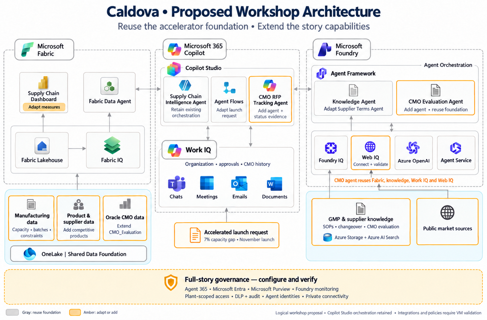

# Proposed architecture image

Gray identifies the reusable accelerator foundation. Amber identifies adaptations or additions. The image retains Copilot Studio orchestration and shows the fuller proposed story coverage before the team chooses simplifications in the [decision table](README.md).

The image was generated by editing the senior’s supplied diagram with the built-in image generation tool. It is a logical proposal, not evidence of deployed connections, enforced policies or automatic permission inheritance. Consult the [architecture recommendations](caldova-architecture-review.md) and [detailed evidence](caldova-accelerator-gap-assessment.md) for implementation boundaries.
