# 2. Rapid Prototyping


Now that you have completed the envisioning **Whiteboard session** and identified key business opportunities, it is time to move from ideas to a working prototype. Explore how a intelligent solution can bring the envisioned scenario to life, validate its potential, and demonstrate how it could work in practice.

## Rapid Prototyping using GitHub Copilot

You will use GitHub Copilot to generate ARM or Bicep templates using the Future State Architecture arrived at from the previous Whiteboarding exercise.

- **ARM templates:** JSON-based Infrastructure-as-Code files used to define and deploy Azure resources.
- **Bicep templates:** Simplified, declarative Infrastructure-as-Code files used to define and deploy Azure resources with cleaner syntax.

### Step1: Verify Resources in the Azure Resource Group

1. Navigate to the [Azure portal](https://portal.azure.com/). Search for **Resource groups**. and Click on **rg-unified** Resource Group.

   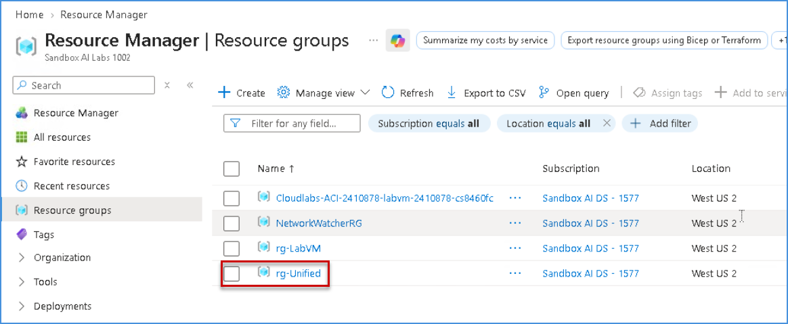

1.  Confirm that the resource group contains the following resources:
   - **Fabric Capacity**
   - **SQL Database** 
   - **SQL Server** 
   - **Storage Account**

   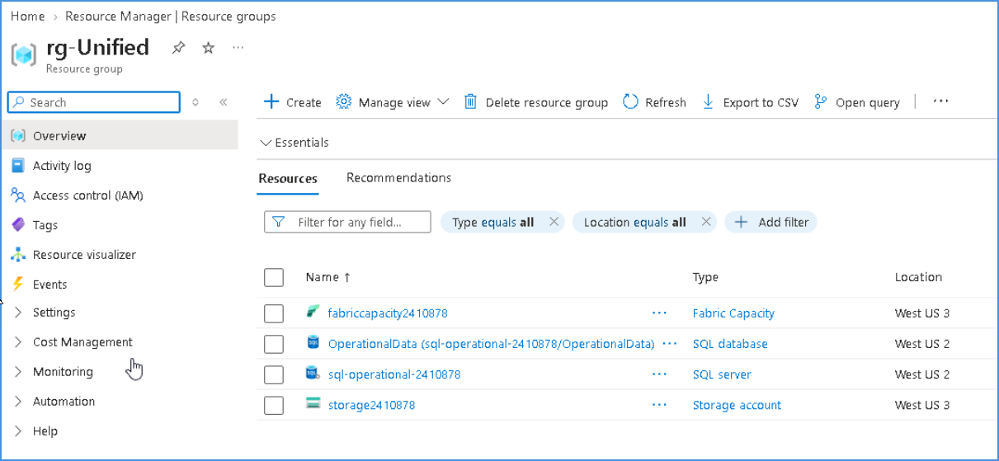

1. Verify that the resources are available in their respective Azure regions and that the migration environment has been provisioned successfully.


## Sign in to GitHub Copilot Chat

### Step 1: Creation Of Fabric Workspace

1. Click on the **Visual Studio Code** from the VM desktop.

   

1. Click on **Continue with GitHub** to sign in to GitHub Copilot.

   

1. On the **Sign in to GitHub** tab, enter the provided **GitHub username** **(1)** in the input field, and click on **Sign in with your identity provider** to continue **(2)**.

    - **Username:** <inject key="GitHub User Name" enableCopy="true"/>

     

1. Click on **Continue** on the **Single sign-on to CloudLabs Organizations** page to proceed.

   

1. Click on **Accept**.

   

1. Select **Continue** to **Authorize Visual Studio Code**.

   

1. Select **Authorize Visual Studio Code**.

   

1. Select **Open**.

   

1. Once the Visual Studio code opens, choose any desired theme **(1)** and then click **Get Started (2)**.

   

   

   >**Note:** If you get any error pop up, please **Close.**

      

    - **Close** the pop up.  

     >**Note**: Please follow the steps sequentially as indicated by the numbered brackets (e.g., (1), (2), …) and execute them in the specified order.

1. Select **File (1)** and then **Open Folder (2)**.

   

1. Navigate to **`C:\`** path **(1)**, then select the **Unifydata** folder **(2)** and then **Select folder (3)**.

   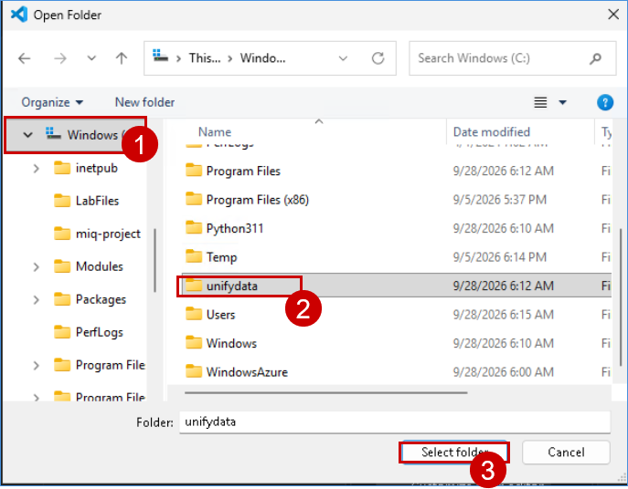

1. From the **GitHub Copilot Chat**, select **Models (1)** and then select **Trust Workspace to enable models (2)**.

   

1. Select **Trust Folder and Continue**.

   

1. Click **Auto (1)** and then set the model to **Claude Sonnet 5 (2)**.

   

    >**Note:** If you're unable to select the **Models**, please wait for `2-3 minutes` then check and make sure you're signed in properly.

1. Click on **Default permission (1)** and then set it to **Allow all (2)**.

   

1. Select **Enable**.

   


1. Please copy the below prompt and paste it in the copilot chat win

   ```
   You are my Smart Agent supporting Caldova Pharma. I am planning to build a unified solution to improve business operations and decision-making.
 
   Please follow the instructions below to build Fabric Workspace:
   
   Instructions:
   
   Use existing Resource Group (rg-unified) and proceed further.
   
   Use existing storage account(storage2410878) and container inside this.
   
   Use existing Fabric Capacity (fabriccapacity2410878).
   
   Create a new Fabric Workspace (Caldova-Pharma) and attach capacity.
   
   Please provide Fabric admin access to the UPN (odl_user_2410878@sandboxailabs1002.onmicrosoft.com) to see the fabric workspace (Caldova-Pharma)

   ```

   - Then **Send (3)**.

    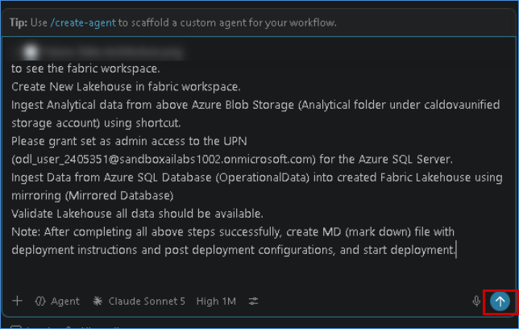
   
1. Once Copilot starts generating the response, monitor the process closely. Do not take any action; simply watch the progress.

1. If Copilot Asks to aunthenticate like below, please click on provided link and provide the code which was given by copilot 

   

1. Click on Yes, completed and then click on **Submit** button
    
    

1. After some time, Copilot may ask you a few questions. Review each question carefully and select the appropriate response. 

1. Monitor the process to understand how it generates the response and handles or resolves errors.  

   >**Note:** In between, if it asks you to **Continue to iterate**, please click **Continue**.
   
   >Wait for the deployment to complete.

1. Once the deployment is complete, you can verify the deployed resources by navigating to the resource group.

1. Navigate back to the Azure portal and Click on the **App launcher (1)** and select **Microsoft fabric** icon.

   

1. Navigate to **Workspaces**, there should be workspace created with the name similar to **Caldova-Pharma**. 

   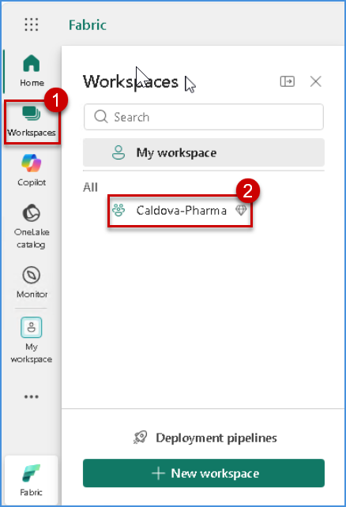


### Step 2: Loading Of Required Delta Tables Into Lakehouse 

1. Navigate back to Github Copilot 

1. Copy the below prompt and paste it in the chat window 

   ``` 
   Great. You have created Fabric Workspace (Caldova-Pharma). Now follow below instructions to create Lakehouse and delta table for Analytical data.
 
   Instructions:  
   
   Use above Resource Group, Azure Blob storage account, Fabric capacity, and Fabric Workspace.
   
   Create New Lakehouse (Caldova-Lakehouse) in the above Fabric workspace.  
   
   After Lakehouse is created, ingest data from Azure Blob and follow the steps below.
   
   Connect storage account(storage2410878) and Container (data)  
   
          a. Extract/Read analytical data from the Analytical folder exist under above container. 

          b. Load data (csv files) into the above created (Caldova-Lakehouse) using Shortcut technique.
   
   After completing above steps, please validate Lakehouse and all delta tables are created successfully.
   
   Great. Now you have created Fabric Lakehouse in the Workspace (Caldova-Pharma) and ingested data from Azure Blob  storage. Now follow the instructions below to ingest operational data from Azure SQL Database.
   
   Instructions:  
   
   Use the above Resource Group, Azure Blob storage account, Fabric capacity, Fabric Workspace, and Lakehouse  (Caldova-Lakehouse).  
   
   Connect to Azure SQL Server (sql-operational-2410878.database.windows.net) and its Database (OperationalData)  
   
   Use UPN: odl_user_2410878@sandboxailabs1002.onmicrosoft.com to connect above SQL Server and Database to read/  ingest Operational data into Lakehouse  
   
   Create Fabric Mirrored Database and connect to Azure SQL Server for Operational Data.
   
   Ingest data and create delta tables in the above created Lakehouse using shortcut pointing to Mirrored database.
   
   After completing the above steps, please validate Lakehouse. All delta tables are created successfully and data moved from Azure SQL Database.  
   ```

1. Monitor the process to understand how it generates the response and handles or resolves errors.  

   >**Note:** In between, if it asks you to **Continue to iterate**, please click **Continue**.
   
   >Wait for the deployment to complete.

1. Once the deployment is complete, you can verify the created Lakehouse in fabric workspace.

1. Navigate to the **Microsoft Fabric** portal and Open the **Caldova_Lakehouse** lakehouse from the workspace.

1. In the **Explorer** pane, expand **Tables**.

1. Verify that the required tables are available in the lakehouse.

1. Select the **DimDate** table to open and review the table data. 

   

1. Navigate back to Github Copilot 

1. Copy the below prompt and paste it in the chat window 

   ```
   Great. Now you have created Fabric Lakehouse in the Workspace (Caldova-Pharma) and ingested data from Azure Blob storage. Now follow the instructions below to ingest operational data from Azure SQL Database.
 
   Instructions:  
   
   Use the above Resource Group, Azure Blob storage account, Fabric capacity, Fabric Workspace, and Lakehouse (Caldova-Lakehouse).  
   
   Connect to Azure SQL Server (sql-operational-2410878.database.windows.net)    and its Database (OperationalData)  
   
   Use UPN: odl_user_2410878@sandboxailabs1002.onmicrosoft.com to connect  above SQL Server and Database to read/ingest Operational data into    Lakehouse  
   
   Create Fabric Mirrored Database and connect to Azure SQL Server for  Operational Data.
   
   Ingest data and create delta tables in the above created Lakehouse using   shortcut pointing to Mirrored database.
   
   After completing the above steps, please validate Lakehouse. All delta  tables are created successfully and data moved from Azure SQL Database.  

   ```

1. Once the deployment is complete, you can verify the Created tables in the same Lakehouse.

   


### Step 3: Loading Business Application Data into Fabric SQL Database:

The business application data is currently stored as files in the **Azure Storage Account**. In this step, we will make this application data available in **Fabric SQL Database** so that it can be used by downstream applications, reporting, analytics, and AI workloads.

The data movement will be orchestrated using an **Azure Logic App**. The Logic App will act as the integration layer between Azure Storage and Fabric SQL Database.

1. Navigate back to Github Copilot 

1. Copy the below prompt and paste it in the chat window 

   ```
   Great, you have brought all data. Please follow below instructions to bring Business application data to Fabric SQL Database.
 
   Instructions:
   
   1. Use existing Resource Group: rg-unified.
   
   2. Create a new Fabric SQL Database in the existing Fabric Workspace    (Caldova-Pharma).
   
   3. Create a new Azure Integration Service in the above resource group.
   
   4. Create an Azure Logic App to read Application data from:    storage2410878→ Application folder under data contrainer and load it into  the Fabric SQL Database.

   ```

1. When the terminal prompts you to install the required extension, review the message displayed.

1. If you see the following prompt:

   ```text
   The command requires the extension logic.
   Do you want to install it now?
   The command will continue to run after the extension is installed. (Y/n):

1. Enter Y and press Enter to allow the required Azure CLI extension to be installed.

   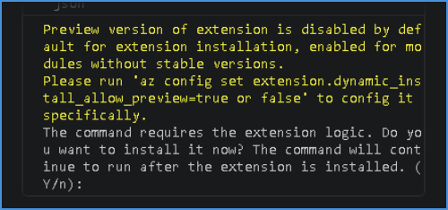

1. Once the deployment is complete, you can verify the Created tables in Fabric SQL Database

1. Open the **Caldova_BusinessApp_SQLDB** from the **Caldova-Pharma** workspace.

1. In the **Explorer** pane, expand **dbo** and then expand **Tables**.

1. Verify that the business application tables have been loaded successfully. For example:
   - **CustomerAddress**
   - **CustomerDetails**

   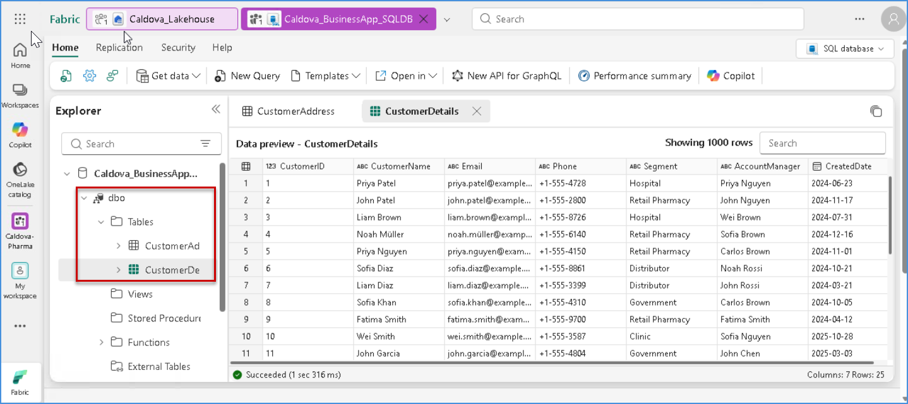

1. Next, navigate to the **Azure Portal** and open the **rg-Unified** resource group.

1. Under **Resources**, verify that the integration components created for the data-loading process are available:
   - **caldova-blob-connection** – API connection used to connect to the Azure Storage account.
   - **caldova-businessapp-ingest** – Logic App responsible for orchestrating the data ingestion.
   - **caldova-fabricsql-connection** – API connection used to connect to the Fabric SQL Database.
   - **caldova-integration-account** – Integration Account used as part of the integration workflow.

   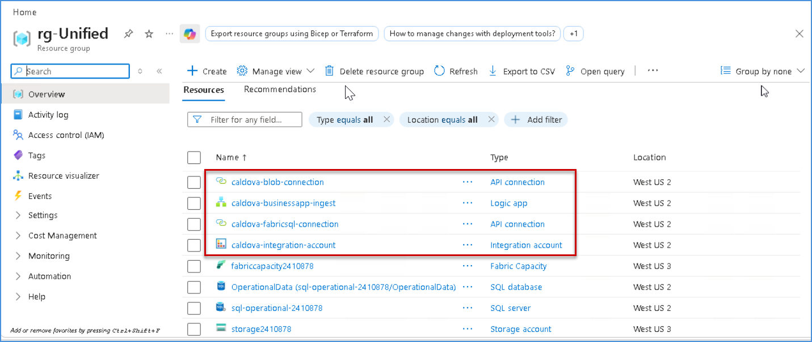

### Step 4: 

1. Navigate back to Github Copilot 

1. Copy the below prompt and paste it in the chat window 

   ```
   Great, You have loaded all data, please follow below instructions to create semantic model and Data agent in fabric workspace
 
   1. Create ONE Semantic Model using Direct Lake mode.  
   
   Add ALL tables from the existing Fabric Lakehouse and Fabric SQL Database.
   
   Create and validate proper relationships between related tables.
   
   Ensure all tables and relationships are visible, connected, and usable in  the Semantic Model.
   
   2. Create one Data Agent using the Semantic Model and add concise instructions based on the available tables.

   ```
1. Navigate to Fabric Portal

1. Open the created **semantic model** and review the configured table relationships to ensure the data model is correctly connected.

   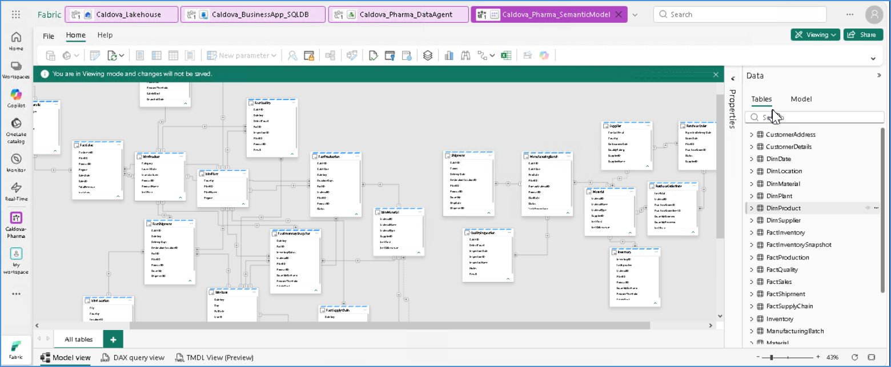

1. Locate the created **semantic model** and Select the **More options (...)** menu for the semantic model and Select **Create report**.

   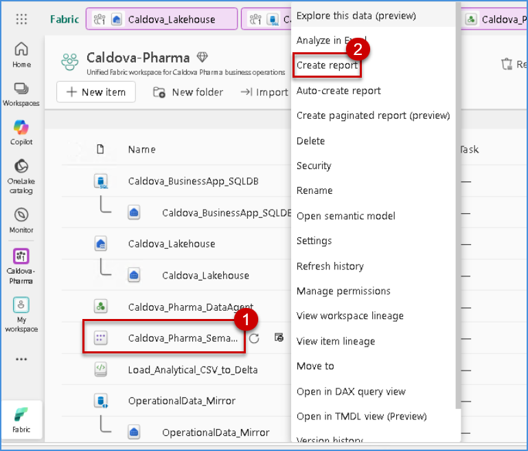

1. Click on **Copilot** icon on top and paste the below prompt and click send button to create Report 

   ```
   Create a Caldova Pharma Operations Report using only the attached semantic model. Build a clean single-page dashboard with 5 KPI cards at the top (Orders, Revenue/Sales, Products, Customers, Inventory/Stock), followed by 3–4 visuals including a donut chart, bar chart, line chart, and trend chart. Use relevant fields and measures from the model without inventing data, and apply a professional, consistent blue theme with clear titles, proper formatting, and an executive-friendly layout.

   ```

   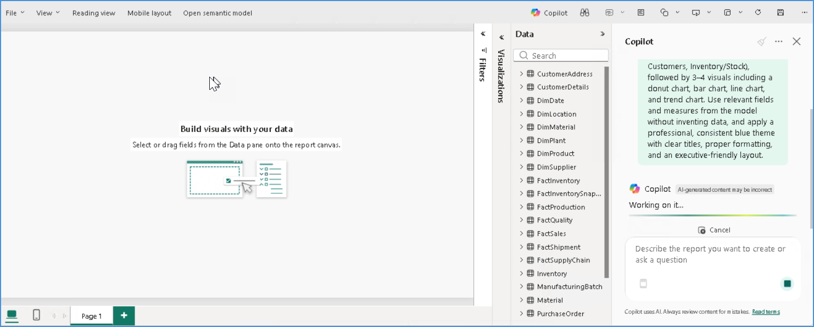

1. Once Copilot finishes creating the report, review the generated report.

   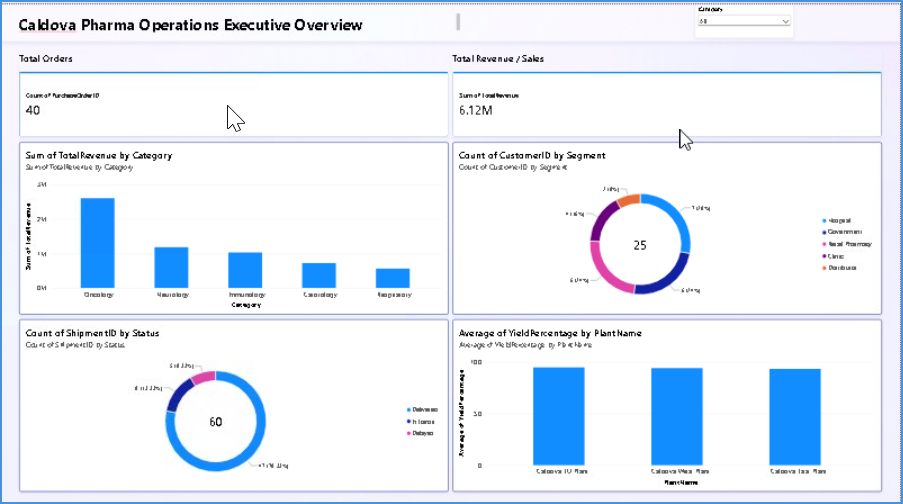

1. Navigate to the created **Data Agent**.

1. Open the **Data** section and verify that the tables are selected and available to the Data Agent.

   - If the tables are not selected, select the tables.

   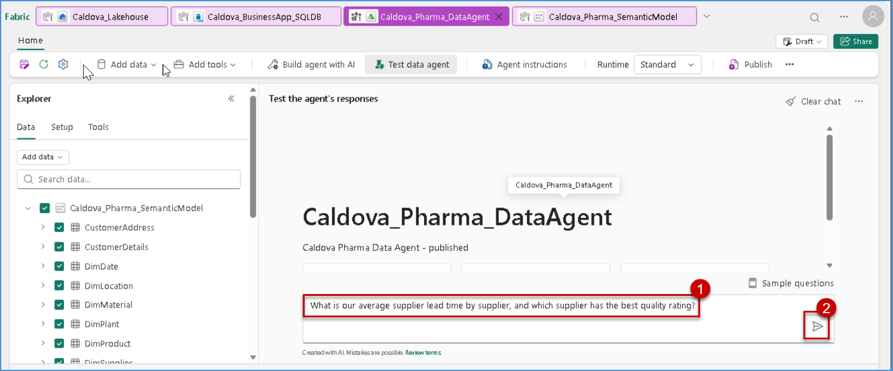

1. Open the **Test Agent** option.

1. Copy the following prompt and paste it into the test chat: 

   ```
   What is our average supplier lead time by supplier, and which supplier has the best quality rating?

   ```

1. Review the response provided by the **Data Agent**

   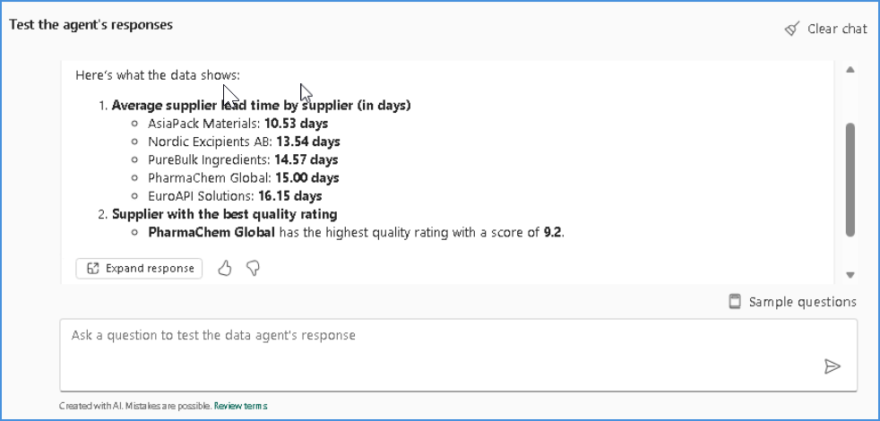


### Congratulations! You have successfully completed the `Rapid Prototyping using GitHub Copilot` session and validated the Microsoft IQ solution across` Fabric IQ, Foundry IQ`, and `Work IQ`.