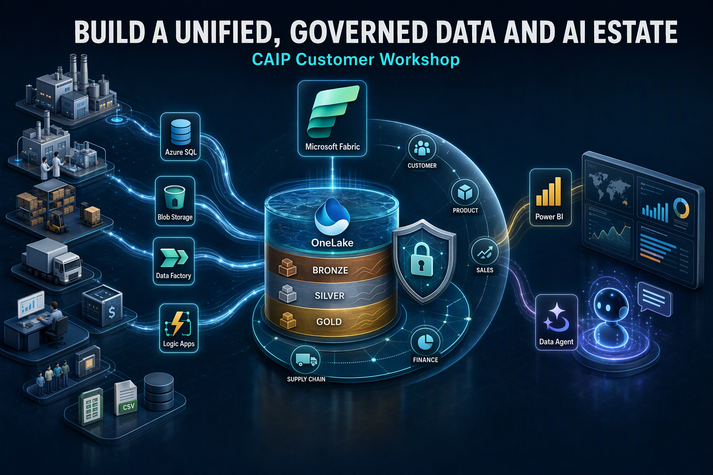

# Build a Unified, Governed data and AI estate CAIP Customer Workshops
*Overview about Build a Unified, Governed data and AI estate*

# Workshop Overview

Modern data estates often bring together operational systems, analytical platforms, business applications, reporting tools, and AI experiences. The challenge is not only to connect these systems, but to create a trusted and reusable data foundation that can support analytics, reporting, and AI while remaining governed, secure, and interoperable.

In this workshop, participants will work through an accelerator architecture that brings together **Microsoft Fabric, OneLake, Azure Integration Services, operational and analytical data sources, Power BI, and AI experiences**.

The workshop follows a practical, co-build approach. Rather than learning each service in isolation, participants will see how these capabilities work together as part of an end-to-end data estate and will then implement key components in a sandbox environment.

## What You Will Learn

By the end of the workshop, participants will understand how to:

### 1. Establish OneLake as a Shared, Reusable Data Foundation

The first step is to establish a common data foundation for the organization's analytical and operational data.

In this architecture, **Microsoft Fabric OneLake** acts as this unified foundation. Operational data can originate from systems such as Azure SQL Database, ERP, or other operational applications, while analytical data can reside in sources such as Azure Blob Storage, data lakes, or SaaS platforms.

Rather than creating isolated data silos for every workload, OneLake provides a common platform where data can be accessed, organized, governed, and reused across multiple Fabric workloads.

In the hands-on exercises, participants will work with both operational and analytical data and bring them into the Fabric environment to demonstrate how OneLake can serve as the shared foundation for downstream analytics, reporting, and AI.

---

### 2. Connect Sources In Place Using Data Factory, Mirroring, and Shortcuts

A modern data platform should minimize unnecessary data movement and duplication wherever possible.

Microsoft Fabric provides several connectivity patterns to achieve this. **Data Factory** can be used to build data integration pipelines, **Mirroring** can provide near-real-time replication of supported operational sources into Fabric, and **OneLake Shortcuts** can provide access to data residing in external storage without requiring another physical copy of the data.

implementation:

- Operational data from **Azure SQL Database** is connected to Fabric using **Mirroring**.
- Analytical data residing in **Azure Blob Storage** is accessed through **OneLake Shortcuts**.
- Both datasets become available within the Fabric environment for downstream processing and analytics.

This approach demonstrates how organizations can create a unified data experience while reducing unnecessary data copies and simplifying data integration.

---

### 3. Keep the Data Estate Open and Interoperable

As organizations evolve, their data platforms, processing engines, analytical tools, and business applications may change. A future-ready architecture should therefore avoid tightly coupling data to a single tool or processing engine.

The accelerator architecture addresses this by using **OneLake as the common data foundation while keeping source systems and consumption experiences loosely coupled**.

For example, data can originate from Azure SQL Database or Azure Blob Storage and be exposed through Fabric experiences such as the **Lakehouse and SQL**. Downstream consumers such as Power BI and AI experiences can then use the governed data without requiring every consumer to directly depend on the original source system.

This provides flexibility as organizations introduce new tools, engines, workloads, or analytical experiences.

> **Workshop validation:** The architecture identifies this capability as "Open and Interoperable." During the workshop, participants should validate with stakeholders what specific interoperability or portability requirements need to be demonstrated—for example, support for multiple processing engines, open data formats, external tools, or reduced dependency on proprietary interfaces.

---

### 4. Converge Operational and Analytical Data with Lakehouse and SQL in Fabric

Organizations often maintain operational and analytical data in separate platforms, which can make it difficult to build a consistent view of the business.

Microsoft Fabric enables these data domains to be brought together within a common platform.

In this accelerator:

- Operational data is made available in Fabric through **Mirroring**.
- Analytical data is accessed from Azure Blob Storage through **OneLake Shortcuts**.
- The resulting datasets are available within the **Fabric Lakehouse**.
- Fabric SQL capabilities provide a familiar SQL-based experience for querying and consuming data.

The Lakehouse can then become the common data layer for transformation, analytics, reporting, and AI workloads.

This convergence allows participants to move from separate operational and analytical data silos toward a unified view of business information.

---

### 5. Integrate Business Applications Using Azure Integration Services

Data platforms need to connect not only to databases and files, but also to the applications where business processes actually occur.

The accelerator architecture uses **Azure Integration Services** to connect business applications with the data platform.

For this workshop scenario, application data is generated by business applications and stored as **JSON files in Azure Blob Storage**. **Azure Logic Apps** are then used to orchestrate the integration flow, process and validate the incoming data, and make it available in the **Fabric SQL Database**.

The architecture can also incorporate services such as **Azure Service Bus or Event Grid** when event-driven integration is required.

This demonstrates how application integration and data integration can work together to move business data from operational applications into a governed analytical environment.

---

### 6. Discover, Govern, and Secure the Data Estate with OneLake Catalog

As the number of data sources, Lakehouses, databases, semantic models, and reports increases, simply storing data is not enough. Users need to be able to **discover the right data, understand it, and access it securely**.

**OneLake Catalog** provides a centralized experience within Microsoft Fabric for discovering and working with data assets across the organization's data estate.

In this workshop, participants will work with Fabric workspaces and data assets such as Lakehouses, SQL databases, and semantic models. They will see how the Fabric environment provides a centralized place to discover these assets and apply governance and security practices.

The goal is to move from simply "having data" to having **trusted, discoverable, governed, and reusable data**.

---

### 7. Deliver Consistent Business Meaning Through Power BI Semantic Models

A unified data platform is only valuable when business users can consume the data consistently.

The **Power BI semantic model** provides a business-friendly layer between the underlying data and the reporting or AI experiences.

In the accelerator implementation, tables from the **Fabric Lakehouse and Fabric SQL Database** are used to create a semantic model. The semantic model defines important business concepts such as:

- Measures and KPIs
- Relationships between business entities
- Business calculations
- Consistent business definitions
- Security and access rules

Power BI reports can then be built on top of this semantic model.

The same governed business representation can also support AI experiences such as **Fabric Copilot for Power BI**, allowing users and agents to work with a consistent understanding of the underlying business data.

This helps prevent different reports or AI experiences from calculating the same business metric in different ways.

---

### 8. Collaboratively Design a Future-State Architecture Using Microsoft Whiteboard

Technology implementation should be driven by business requirements and architectural decisions rather than by individual services alone.

Participants will use **Microsoft Whiteboard** as a collaborative space to discuss the current state, identify data and integration challenges, and design a future-state architecture.

The objective is to move from:

**Business Requirement → Architecture Decision → MVP Scope → Implementation**

Participants can collaboratively identify:

- Business applications and data sources
- Operational and analytical data domains
- Integration requirements
- Data governance and security requirements
- Reporting and AI use cases
- Required Fabric capabilities
- MVP components and priorities

This collaborative approach helps accelerate alignment between business stakeholders, architects, data engineers, and application teams before moving into implementation.

---

# Co-Build, Validate, and Rapidly Prototype

This workshop is designed as a **hands-on co-build experience** rather than a theoretical architecture discussion.

Participants will work in sandbox environments to build and validate the key components of the accelerator architecture. They will use Microsoft and Azure acceleration capabilities to rapidly move from architecture concepts to a working prototype.

Throughout the exercises, participants will:

1. **Connect real-world data sources** to the Fabric environment.
2. **Integrate operational and analytical data** using Fabric-native capabilities.
3. **Use OneLake Shortcuts and Mirroring** to simplify data access and integration.
4. **Integrate application data** using Azure Integration Services.
5. **Build a unified Lakehouse and SQL data layer**.
6. **Apply governance and discovery practices** using the Fabric environment and OneLake Catalog.
7. **Create a Power BI semantic model** that provides consistent business meaning.
8. **Build reports and AI experiences** on top of the governed semantic layer.
9. **Collaboratively validate the architecture** against business requirements.
10. **Identify gaps and next steps** required to move from prototype to MVP.

The end goal is not simply to create individual Fabric artifacts. The objective is to demonstrate how these capabilities can work together to create a **trusted, reusable, governed, and scalable data estate** that supports operational analytics, business reporting, and AI-driven insights.

> **By the end of the workshop, participants will have both a working prototype and a clearer understanding of how the architecture can evolve into an MVP and eventually into a production-ready data platform.**

## Accessing your Sandbox Environment

1. Once you're ready to dive in, your Virtual machine and Guide will be right at your fingertips within your web browser.

    >**Note**: If prompted, click on **Accept** to Proceed.

     

1. On your Virtual machine, click on the **Azure Portal** icon.

   

1. You'll see the **Sign into Microsoft Azure** tab. Here, enter your credentials:

   - **Email/Username:** <inject key="AzureAdUserEmail"></inject>

     

1. Next, provide your password:
 
   - **Password:** <inject key="AzureAdUserPassword"></inject>

     

1. If a pop-up appears **Stay signed in**, then select **Yes**.

   

1. You will return to this portal in the upcoming steps. Keep the portal open and proceed with the next steps.

### Now, click on **`Next >>`** to continue with **`Envisioning Session Using Whiteboarding`**.
