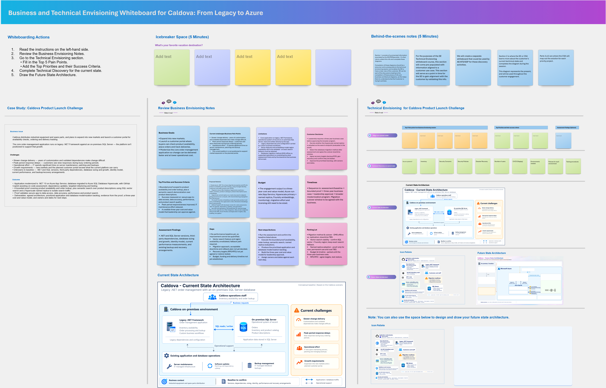

## 1. Envisioning Session Using Whiteboarding

### Whiteboarding
Whiteboarding helps technical teams align **Caldova’s business goals, current application and data challenges, modernization priorities, and future-state architecture**. It transforms modernization ideas into a shared visual plan and helps identify where Microsoft technologies and Solution Accelerators can accelerate the journey.

For the **Caldova scenario**, start by exploring the current environment and identifying applications, databases, dependencies, integration points, scalability concerns, and modernization opportunities.

Use whiteboarding to architect a future-state solution that helps Caldova:

- Assess the current application and database landscape
- Identify modernization priorities and dependencies
- Modernize applications and databases with confidence
- Introduce AI capabilities into modernized applications
- Improve scalability, reliability, security, and operational efficiency
- Create a connected future\-state architecture across applications, data, and AI
- Accelerate implementation using Microsoft technologies and Solution Accelerators

### Whiteboarding Outcome

By the end of the session, the team has a shared view of **Caldova’s current\-state challenges, modernization priorities, target business outcomes, and future\-state architecture**, providing a clear path from envisioning to rapid prototyping and implementation.

### How to copy the Whiteboard using an existing template URL

1. Open a new browser tab in the Edge browser.

1. Right click on the following Whiteboard template link -  ["Whiteboard Template"](https://sandboxailabs1005-my.sharepoint.com/:wb:/g/personal/caipuser_sandboxailabs1005_onmicrosoft_com/IQBJ1isDhRDWTYbg7rG092znAa72B_R5ObN7AstWuoYDoEE?e=KyPa16), then select **Copy link** and then paste it on the browser tab.

1. If prompted, sign in with your ODL user credentials.

1. Once you login, you will get a pop-up message to create the new Whiteboard. Read the message and click **Got it**.

   

1. Use the **Zoom out** option to view the Whiteboard template clearly.

   

1. Please follow along as the **Facilitator** guides you through the **Business** and **Technical** Envisioning session. During the session, you will identify key business challenges, define priorities, assess the current environment, and design a Future-state solution architecture.

### Activities

1. Review the **Business Envisioning Notes** to understand the organization's goals, challenges, and desired outcomes.

1. Go to the **Technical Envisioning** section and:
   - Capture the **Top 5 Pain Points**.
   - Define the **Top Priorities** and corresponding **Success Criteria**.

1. Complete the **Technical Discovery** by documenting:
   - Current-state architecture
   - Systems

1. Design the **Future State Architecture** to illustrate how the proposed solution addresses business needs and technical requirements.

1. Review the completed envisioning outputs and validate their alignment with the desired business outcomes.

## This completes the Envisioning Session using Microsoft Whiteboarding.

### Now, click on **`Next >>`** from the lower right corner to move on to **`Rapid Prototyping`**.
