# 2. Rapid Prototyping

- <inject key="openaiPrimaryKey" enableCopy="false"/>

Now that you have completed the envisioning **Whiteboard session** and identified key business opportunities, it is time to move from ideas to a working prototype. Explore how a intelligent solution can bring the envisioned scenario to life, validate its potential, and demonstrate how it could work in practice.

## Rapid Prototyping using GitHub Copilot

You will use GitHub Copilot to generate ARM or Bicep templates using the Future State Architecture arrived at from the previous Whiteboarding exercise.

- **ARM templates:** JSON-based Infrastructure-as-Code files used to define and deploy Azure resources.
- **Bicep templates:** Simplified, declarative Infrastructure-as-Code files used to define and deploy Azure resources with cleaner syntax.

### Sign in to GitHub Copilot Chat


1. Click on the **Visual Studio Code** from the VM desktop.

   

1. Click on **Continue with GitHub** to sign in to GitHub Copilot.

   

1. On the **Sign in to GitHub** tab, enter the provided **GitHub username** **(1)** in the input field, and click on **Sign in with your identity provider** to continue **(2)**.

    - **Username:** <inject key="GitHub User Name" enableCopy="true"/>

     

1. Click on **Continue** on the **Single sign-on to CloudLabs Organizations** page to proceed.

   

1. Click on **Accept**.

   

1. Select **Continue** to **Authorize Visual Studio Code**.

   

1. Select **Authorize Visual Studio Code**.

   

1. Select **Open**.

   

1. Once the Visual Studio code opens, choose any desired theme **(1)** and then click **Get Started (2)**.

   

   

   >**Note:** If you get any error pop up, please **Close.**

      

    - **Close** the pop up.  

     >**Note**: Please follow the steps sequentially as indicated by the numbered brackets (e.g., (1), (2), …) and execute them in the specified order.

1. Select **File (1)** and then **Open Folder (2)**.

   

1. Navigate to **`C:\`** path **(1)**, then select the **miq-project** folder **(2)** and then **Select folder (3)**.

   

1. From the **GitHub Copilot Chat**, select **Models (1)** and then select **Trust Workspace to enable models (2)**.

   

1. Select **Trust Folder and Continue**.

   

1. Click **Auto (1)** and then set the model to **Claude Sonnet 5 (2)**.

   

    >**Note:** If you're unable to select the **Models**, please wait for `2-3 minutes` then check and make sure you're signed in properly.

1. Click on **Default permission (1)** and then set it to **Allow all (2)**.

   

1. Select **Enable**.

   

1. Select the **Future-State-Architecture.png**.

   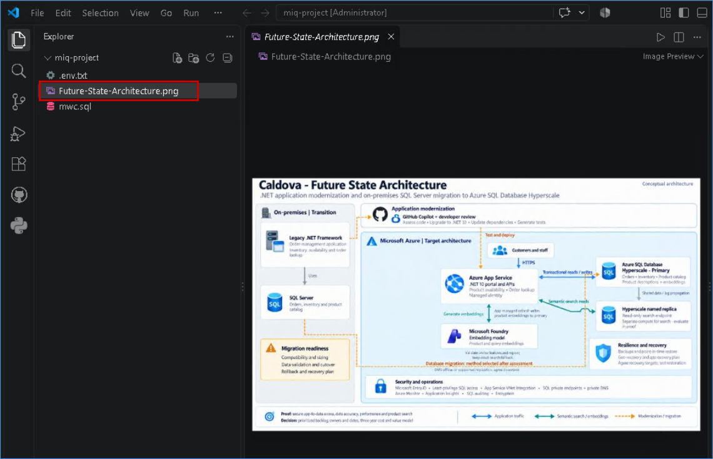

1. From the **GitHub Copilot Chat**, click on **+ (1)** and then select the **Future-State-Architecture.png (2)**.

   

## Migration From On-Prem SQl to Azure SQL DB Hyperscale

Migrate the pharmaceutical manufacturing database from on-premises SQL Server to Azure SQL Database Hyperscale to provide scalable, highly available, and cloud-based data management. The migration preserves critical manufacturing, product, inventory, production, and operational data while enabling improved performance, scalability, and integration with modern Azure analytics and AI services.

1. Along with the attached **Solution Architecture** (1), please paste the below prompt (2).

   ```
   You are my smart agent to understand below are the problem statement and planned solution architecture design which will help Caldova to overcome from their problems. After that, please prepare bicep/ARM template and deploy the resources in the respective environment.

   Proposed Solution: The proposed solution is to migrate Caldova’s on-premises SQL Server database from the existing VM-based environment to Azure SQL Database Hyperscale. The migration will preserve the existing database objects. The migrated database will provide a scalable and secure foundation for the modernized .NET application on Azure App Service and future capabilities such as native SQL vector search over product descriptions, while reducing infrastructure-management overhead and supporting Caldova’s planned business growth.

   Planned Solution Architecture Design: Attached  Future-State-Architecture.png.

   First Migrate OnPrem SQL Database available in the VM to Azure SQL Server(Hyperscale) and modernize it with following below instructions:

   Instructions:
   1.	Use existing Resource-Group (rg-caldova-modernize) in Azure and proceed further
   2.	Use Existing Azure SQL Server and one Azure SQL Hyperscale Database (CaldovaOrderManagement) which is available in same Resource Group
   3.	Make UPN - <inject key="AzureAdUserEmail"></inject> set as admin to the azure sql server and hyperscale databse
   4.	Connect VM: vm-onprem-sql (Public IP: 20.69.251.88) using credentials (User name: azureuser, passwrod: Password@123)
   5.	Connect and Access the OnPrem SQL Sever using credentials
   	User Name: caldova-admin
   	Password: B!Admin@123
   6.	Access database CaldovaOrderManagement in this OnPrem server.
   7.	Migrate Tables and data into the created Azure SQL Hyperscale Database
   8.	Maintain a similar relationship among all tables.

   ```

   - Then click **Send (3)** button.

    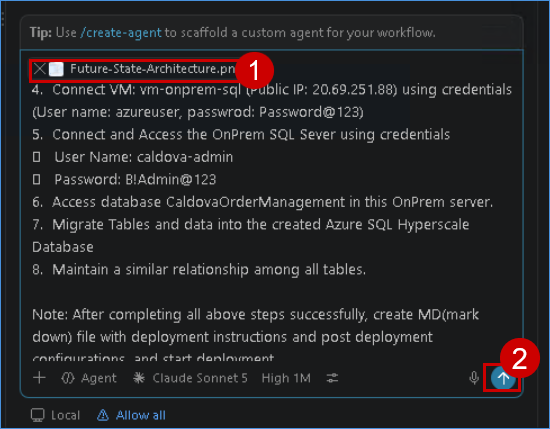
   
1. Once Copilot starts generating the response, monitor the process closely. Do not take any action; simply watch the progress.

1. If Copilot Asks to aunthenticate like below, please click on provided link and provide the code which was given by copilot 

   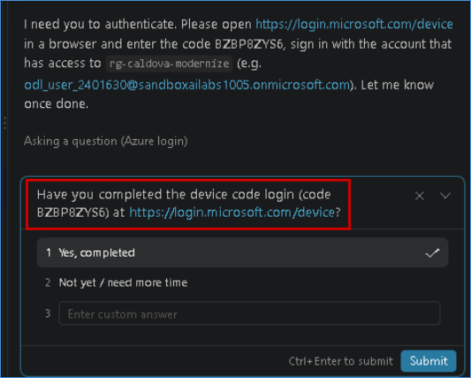

1. Click on Yes, completed and then click on **Submit** button
    
    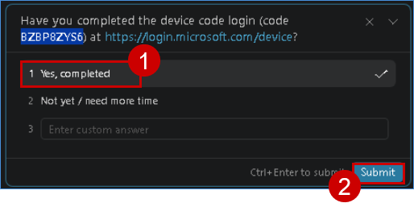

1. After some time, Copilot may ask you a few questions. Review each question carefully and select the appropriate response. 

1. Monitor the process to understand how it generates the response and handles or resolves errors.  

   >**Note:** In between, if it asks you to **Continue to iterate**, please click **Continue**.
   
   >Wait for the deployment to complete. This may take approximately `20–30` minutes.

### Validation - Azure SQL DB Hyperscale

1. Navigate to the [Azure portal](https://portal.azure.com/). Click on **Resource groups**. and Click on **rg-caldova-modernize** Resource Group.

   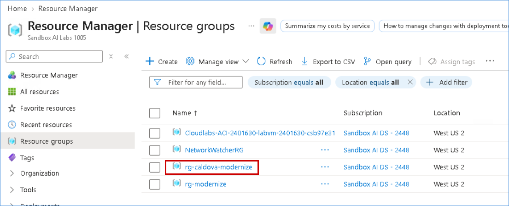

1. You can see all the resources and click on **Azure SQL Database**

   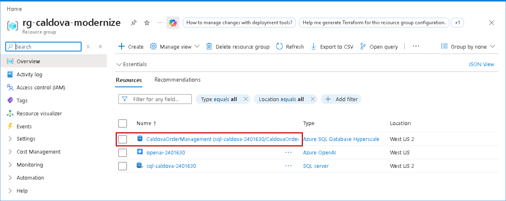

1. Click on **Query Editor** to connect SQL Database and Validate databse objects.

   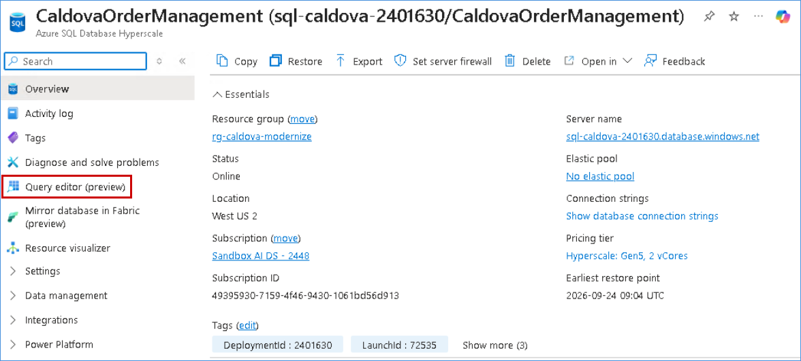

1. To authorize user click on **Connect as odl_user**.

     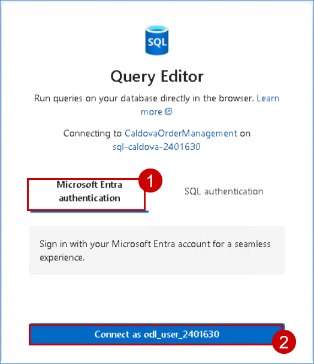

1. Expand Schema(dbo) -> Tables -> and Click any table to see data.

    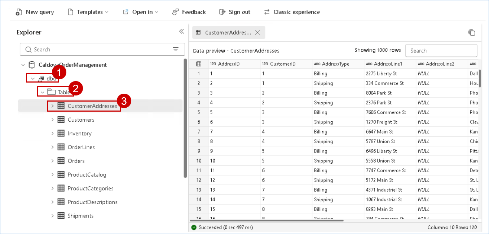   

   >**Note**: Similarly click other tables to compare and validate data.

## Migration From On-Prem Web Application to Azure App Service 

Migrate the pharmaceutical manufacturing web application (Order Management) from on-premises infrastructure to Azure App Service to provide a scalable, secure, and highly available cloud-hosted platform. The migration enables improved application performance, simplified infrastructure management, and seamless integration with Azure services and the modernized Azure SQL Database backend.
 
Follow below instructions to migrate On-prem web application to Azure app service.

1. Navigate to VScode and paste the below prompt in chat window

   ```
   Great, you have completed OnPrem SQL migration to Azure SQL Database Hyperscale. Now we need to migrate OnPrem Web Application to Azure Web App Service and modernize. 

   Follow the instructions below:

   Instructions:
   1.	Use existing Resource-Group (rg-caldova-modernize) in Azure and proceed further
   2.	Connect VM: vm-onprem-sql (Public IP: 20.69.251.88) using credentials (User name: azureuser, passwrod: Password@123)
   3.	Access CaldovaOrderManagement(Caldova.OrderManagement) web application is already deployed in this above VM.
   4.	Migrate CaldovaOrderManagement web application to Azure Web App Service. 
   5.	Modernize the migrated web application and follow below modernization activities:
   a.	Use latest .NET Framework (.NET 10) 
   b.	Use CSS/Bootstrap etc. to make modernize look and feel
   c.	Can use some visuals in the Dashboard page to enhance the look and feel
   d.	Menu items should places at left side of the page. 
   e.	Top banner with company details with optimized details/views
   f.	Modernized Web App responsiveness
   6.	Migrated and Modernized web applications should integrate with Azure SQL Database (CaldovaOrderManagement) and integrate all functional pages to the respective tables. 
   7.	Please include one more page(in Web Application) for "Traditional SQL Search" where user will perform product based search.

   ```
   - Then click **Send** button.

1. Once Copilot starts generating the response, monitor the process closely. Do not take any action; simply watch the progress.

   >**Note:** In between, if it asks you to **Continue to iterate**, please click **Continue**.

### Validation - Azure App Service

1. Navigate back to Azure portal to validate the migrated web application and search for **rg-caldova-modernize** Resource Group. you can see app service resources along with SQL Database

1. Click on **app-caldova-ordermanagement.**

   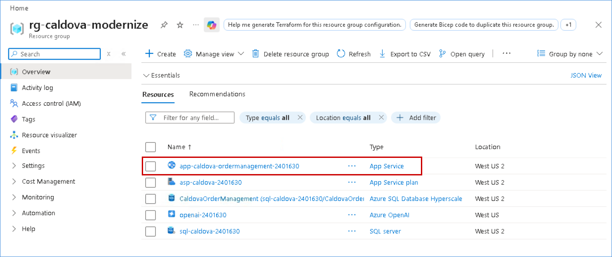

1. You can see all app related information and click on **default domain**

   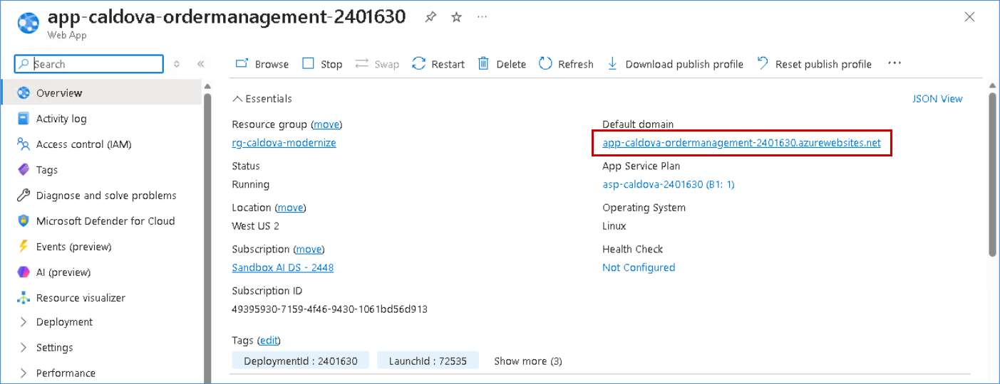

1. It will open application in new tab and you can see migrated application. 

   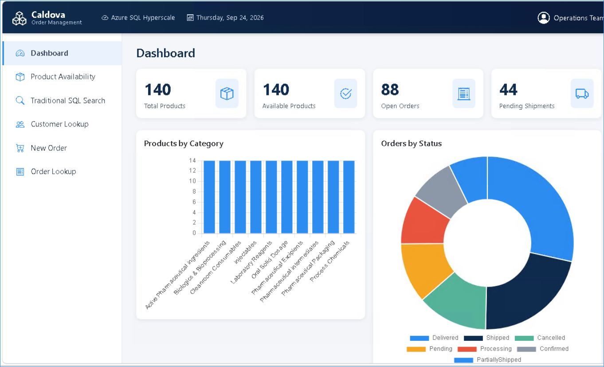

   >**Note:** Will do Semantic search validation once next deployment(Vector embedding) is done.

## Implementation of Vector/Semantic Search in Azure SQL Database Hyperscale

Implement vector search in Azure SQL Database Hyperscale using Azure OpenAI embeddings and the native VECTOR data type to enable natural-language product searches. Query and product embeddings are compared using vector similarity to identify relevant products beyond exact keyword matching, improving search accuracy and product discovery.

1. Navigate to **Visual Studio Code**.

1. In **Visual Studio Code**, open the `.env` file from the project explorer.

   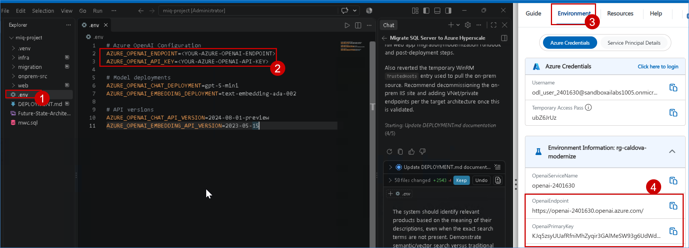

1. Under the **Azure OpenAI Configuration** section, update the following variables:
   - `AZURE_OPENAI_ENDPOINT`
   - `AZURE_OPENAI_API_KEY`

1. In the **Azure Migrate** environment pane on the right, select the **Environment** tab.

1. Under **Environment Information**, locate the **OpenAIEndpoint** value and copy it.

1. Paste the copied endpoint into the `.env` file as the value of `AZURE_OPENAI_ENDPOINT`.

1. In the same **Environment Information** section, locate **OpenaiPrimaryKey** and copy the key.

1. Paste the copied key into the `.env` file as the value of `AZURE_OPENAI_API_KEY`.


1. Copy the below prompt and paste it in chat window

 ```
   Great, both SQL Database and Web application migration were completed successfully.
   BUSINESS OBJECTIVE: Enable semantic/vector search over product descriptions, so users can search using natural language rather than exact keywords.
   Two examples given below:
   "medicine used to reduce fever"
   "best medicine for hypertension"
   "tablet for controlling blood sugar"
 
   The system should identify relevant products based on the meaning of their descriptions, even when the exact search terms are not present. Demonstrate semantic/vector search versus traditional SQL LIKE search.

   IMPLEMENTATION REQUIREMENTS:
   1. Use existing resource-group(rg-caldova-modernize) and proceed further.
   2. Please execute the attached script file (Embedding_Script.sql) for the below activities:
      . Read OpeanAI Configuration details (API Endpoint, Key, Models etc.) from .env file and use it in this SQL script file
      . Use Azure SQL Database (CaldovaOrderManagement) Hyperscale and generate embedding for all existing Products and its Descriptions.
      . Create a table dbo.ProductDescriptionEmbeddings with below columns and  store all embedding details
         1.ProductDescriptionEmbeddingID
         2.ProductID
         3.ProductDescriptionID
         4.ContentText
         5.Embedding
         6.CreatedDate
         7.ModifiedDate
      . Make sure vector embedding should be created for all the products and its descriptions.
      . Store embeddings in the same Azure SQL DB using the SQL vector data type and the correct dimension for the selected embedding model.
   3. Create searchable text representations for each product description.
   4. Create a new Semantic/vector search" page besides the SQL Traditional search page to validate side by side.
   5. Existing Web Application will be used to do semantic search where natural-language query will accept and return matching products with probability score.
   6. Create graphical visualization to the existing web application/dashboard demonstrating the vector search on product trend

   ```
   - Then click **Send** button.


1. Once Copilot starts generating the response, monitor the process closely. Do not take any action; simply watch the progress.

   >**Note:** In between, if it asks you to **Continue to iterate**, please click **Continue**.

### Validation - Traditional SQL Search Vs Vector Semantic Search

1. Navigate Azure Portal and Open Migrated Application

1. In update application you can see **Semantic/Vector search** page got added.

   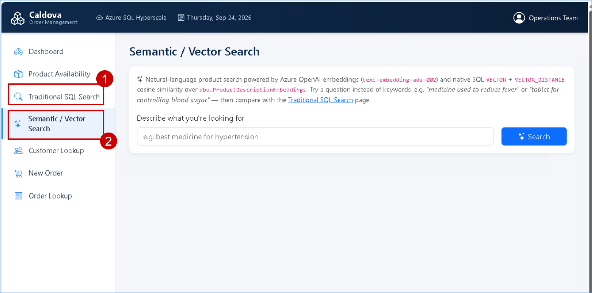

1. Click on **Traditional Sql Search Page** and paste the below prompt in search area and click on **search** button.

   ``` 
   medicine used to reduce fever
   ```
   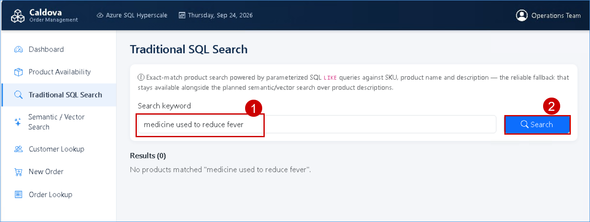

1. You can observe it will return no results.

1. Click on **Semantic/Vector search** page and paste the same prompt in search area and click on **search** button. 

   ``` 
   medicine used to reduce fever
   ```
   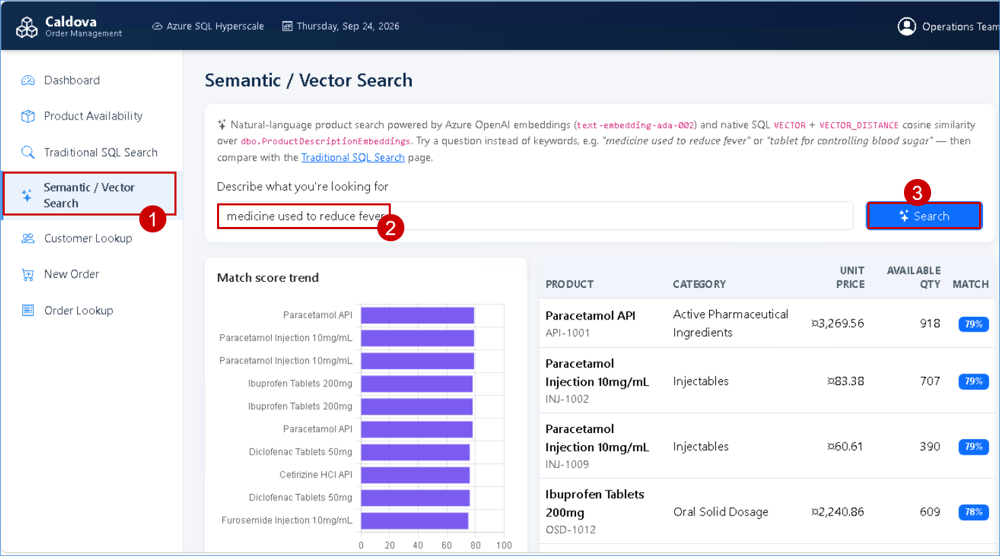

1. It will provide all matching results.


### Congratulations! You have successfully completed the `Rapid Prototyping using GitHub Copilot` session
