# Modernize with Confidence Package

Now that you have deployed the generated template with GitHub Copilot, let’s explore a similar, pre-deployed solution. 

The **Caldova Order Management solution** has already been pre-deployed to provide a ready-to-use modernization experience. You will explore and validate how the pharmaceutical manufacturing application has been modernized from **on-premises SQL Server and web application infrastructure to Azure SQL Database Hyperscale and Azure App Service**.

1. Navigate to the Azure portal. Click on **Resource group**.

   

1. Select the pre deployed **rg-MWC** resource group.

   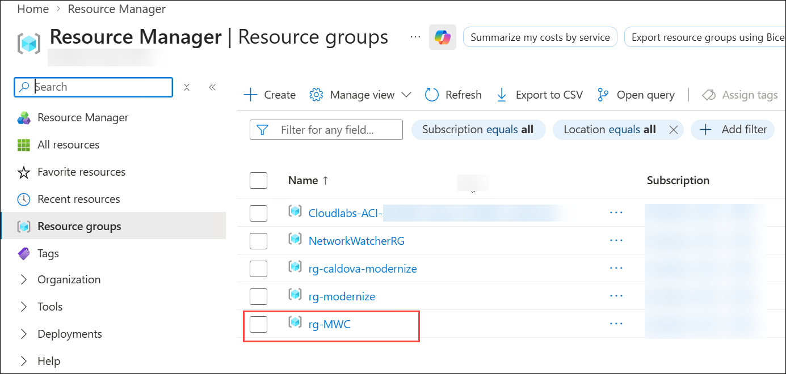

## Migration From On-Prem SQL to Azure SQL DB Hyperscale

The pharmaceutical manufacturing database has already been migrated from on-premises SQL Server to Azure SQL Database Hyperscale. In this section, you will validate the migrated database and verify that the critical manufacturing, product, inventory, production, and operational data is available in the modernized environment.

### Validation - Azure SQL DB Hyperscale

The CaldovaOrderManagement database has already been migrated to Azure SQL Database Hyperscale. In this step, you will validate the database connection, schema, tables, and migrated data to ensure the SQL workload is available in the modernized environment.

1. You can see all the resources and click on *Azure SQL Database Hyperscale* named **CaldovaOrderManagement**.

   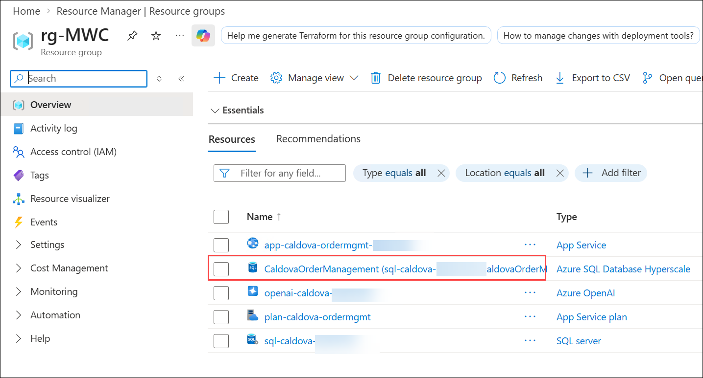

1. Navigate to **Query editor (1)** to connect SQL Database.

   - To authorize user click on **Connect as odl_user_<inject key="Deployment-ID" enableCopy="false"/> (2)**

     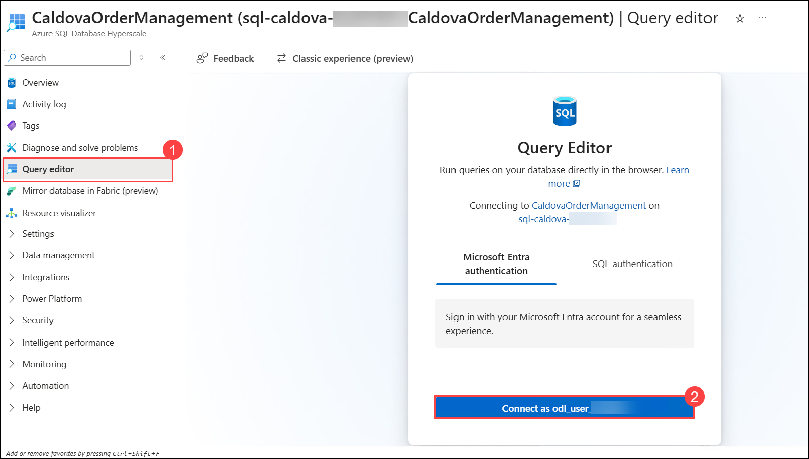

1. Expand **Schema(dbo) (1)** -> **Tables (2)** -> and Click any table **(3)** to see data **(4)**.

   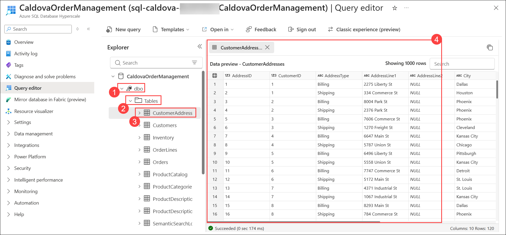

## Migration From On-Prem Web Application to Azure App Service 

The pharmaceutical manufacturing Order Management web application has already been migrated from on-premises infrastructure to Azure App Service. In this section, you will validate the migrated application and confirm that it is connected to the modernized Azure SQL Database backend.

### Validation - Azure App Service

The Caldova Order Management application has already been deployed to Azure App Service. In this step, you will validate the application, access the migrated web experience, and test the existing Traditional SQL Search functionality to understand its limitations with natural-language queries.

1. Navigate back to **rg-MWC** RG. Select the App Service named Click on **app-caldova-ordermgmt-xxxx**.

   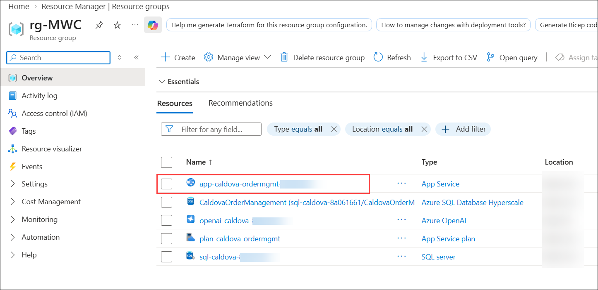

1. You can see all app related information and click on **default domain**.

   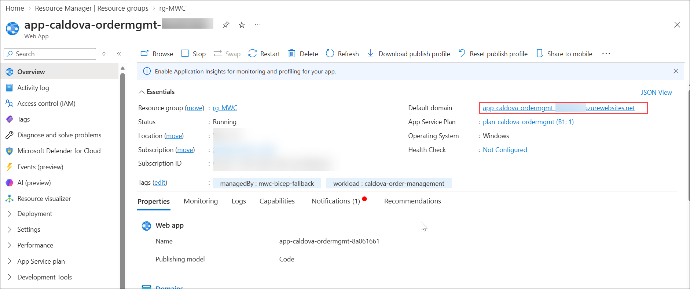

1. It will open application in new tab and you can see migrated application.

   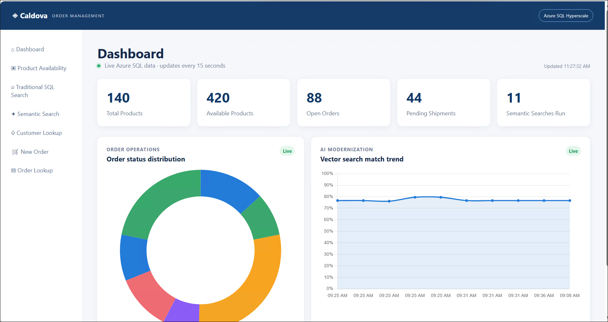

1. In migrated application you can see `Traditional Sql Search` section got added.

1. Click on **Traditional Sql Search** section.

   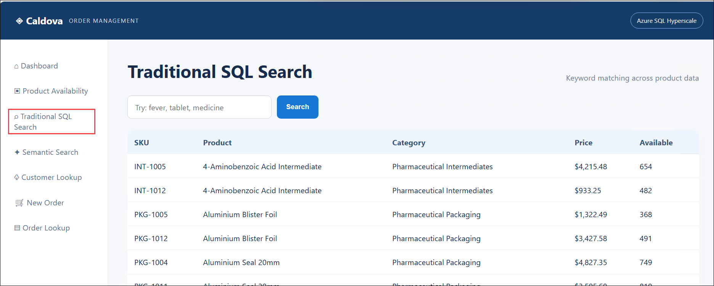   

1. Paste the below prompt in search area **(1)** and click on **Search (2)** button.   

   ```
   medicine used to reduce fever.
   ```

   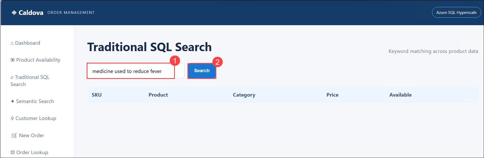     

1. `You can observe it will return no results.`

   The migrated application currently uses traditional SQL search to find products based on exact text matches. Traditional SQL search typically relies on conditions such as LIKE, where the user's search terms need to closely match the words stored in the product description.

   For example, if a product description contains: `"Paracetamol is used to relieve mild pain."` and the user searches for: `"medicine used to reduce fever"`.

   - A traditional SQL `LIKE` search may not return the product because the exact phrase `"medicine used to reduce fever"` does not appear in the product description.

   - This creates a limitation for users because they often search using natural language, synonyms, or different words that express the same meaning.

1. To overcome this limitation, we will enhance the migrated application with **vector/semantic search** using Azure SQL Database Hyperscale and Azure OpenAI embeddings.

   - `Vector search` converts product descriptions and user search queries into numerical **embeddings** that represent their meaning. The application can then compare the similarity between the user's query and product descriptions instead of relying only on exact keyword matches.

     >**Note:** Will do Semantic search validation once next deployment(Vector embedding) is done.

1. In the next Section, we will:

   - Generate embeddings for the existing product descriptions using **Azure OpenAI**.
   - Store the generated embeddings in **Azure SQL Database Hyperscale** using the native `VECTOR` data type.
   - Generate an embedding for the user's natural-language search query.
   - Compare the query embedding with product-description embeddings using vector similarity.
   - Add a **Semantic/Vector Search** page to the migrated web application.
   - Display matching products along with their similarity/probability scores.
   - Add a visualization to demonstrate product search trends based on the vector-search results.

This allows us to demonstrate how the migrated application can move from **keyword-based search** to **meaning-based search** using Azure AI capabilities.

## Implementation of Vector/Semantic Search in Azure SQL Database Hyperscale

The migrated application is being enhanced with vector/semantic search using Azure SQL Database Hyperscale and Azure OpenAI embeddings. This enhancement enables the application to understand the meaning of natural-language queries rather than relying only on exact keyword matches.

### Validation - Traditional SQL Search Vs Vector Semantic Search

The vector/semantic search capability has been implemented using Azure OpenAI embeddings and the native VECTOR data type in Azure SQL Database Hyperscale. In this step, you will validate the semantic search experience using the same natural-language query and compare the results with traditional SQL search.

1. Click on **Semantic Search (1)** section. Paste the same prompt in search area **(2)** and click on **search (3)** button. 

   ``` 
   medicine used to reduce fever
   ```

   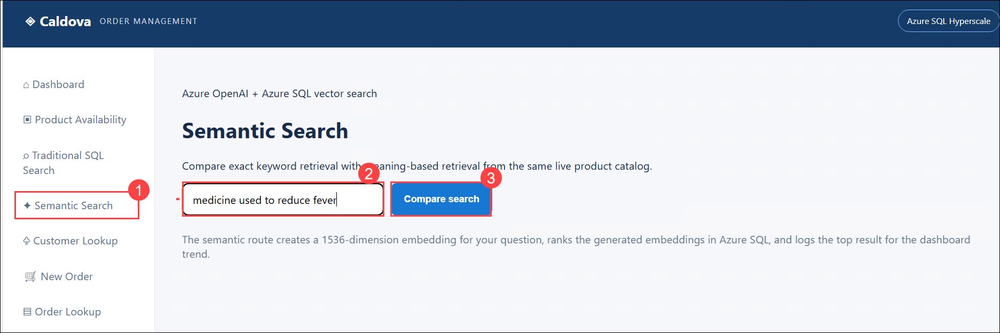 

1. The semantic/vector search can identify products based on the meaning and semantic similarity of the query and product descriptions, even when the exact keywords are not present.

   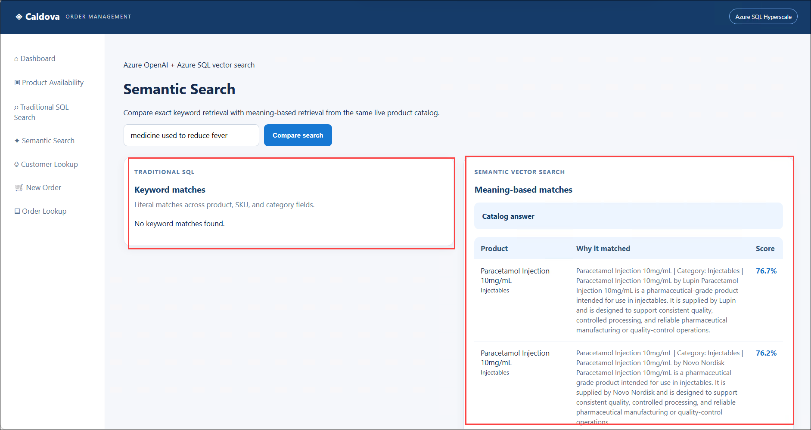 


### Congratulations! You have successfully completed the Workshop.  
