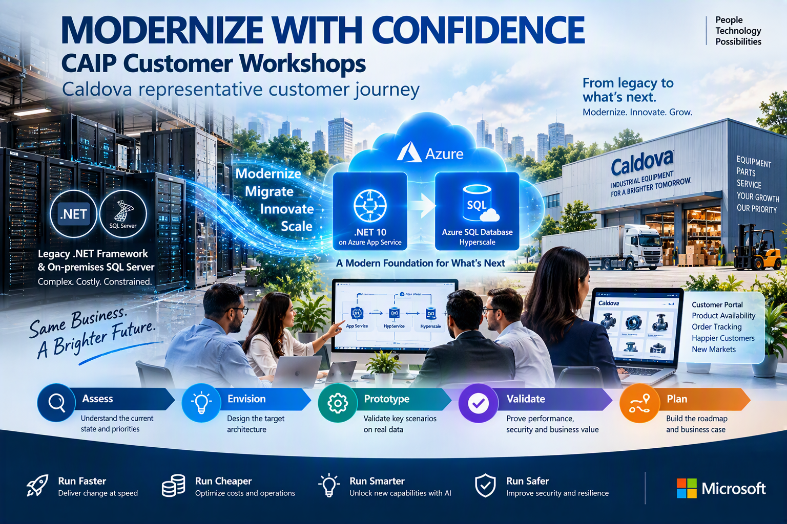

# Modernize with Confidence - CAIP Customer Workshops
*Caldova Representative customer journey*
 
 
 
In this workshop, you will explore an end-to-end modernization journey from **legacy .NET Framework and on\-premises SQL Server to .NET 10 on Azure App Service and Azure SQL Database Hyperscale**.

Using **Whiteboarding and rapid prototyping**, participants assess the current environment, envision the target architecture, validate priority modernization scenarios, and build an actionable roadmap and three\-year business case.

## Caldova Scenario:
Caldova, an industrial equipment and spare-parts distributor, plans to expand into new markets and launch a customer portal for **product availability, ordering, and delivery tracking**.
The current legacy application and database platform is slowing change, increasing operational effort, creating performance challenges, and limiting Caldova's ability to support future growth.

The workshop helps Caldova define and validate a practical modernization journey:
**Assess → Envision → Prototype → Validate → Plan**

### How the Workshop Helps

1. **Whiteboarding → Define the modernization architecture**
    Participants map current application and database dependencies and define the proposed Azure architecture, including:
    
    - Application and database modernization requirements
    - Azure App Service and Azure SQL Database Hyperscale readiness
    - Secure application-to-database connectivity
    - Performance, availability, recovery, and migration considerations
    - Modernization blockers and required remediation

2. **Rapid Prototyping → Validate the approach**
    
    Participants validate a bounded scenario focused on **product availability and order lookup**, including:
    - Secure App Service-to-database connectivity
    - Data accuracy and representative performance
    - Semantic search across product descriptions
    - SQL vector search capabilities
    - Hyperscale named replica evaluation for isolating search workloads

3. **GitHub Copilot** assists developers with code assessment, dependency updates, targeted refactoring, test generation, and developer review.

### Workshop Outcomes
You'll leave the workshop with:
- Agreed target-state architecture
- Application and database modernization readiness findings
- Prioritized modernization backlog
- Prototype-based technical validation
- Execution roadmap with owners, decisions, and next steps
---

## Accessing your Sandbox Environment
1. Once you're ready to dive in, your **Virtual machine** and **Guide** will be right at your fingertips within your web browser.

    >**Note**: If prompted, click on **Accept** to proceed.

     

1. On your Virtual machine, click on the **Azure Portal** icon.

   

1. You'll see the **Sign in to Microsoft Azure** tab. Here, enter your credentials:

   - **Email/Username:** <inject key="AzureAdUserEmail"></inject>

     

1. Next, provide your password:
 
   - **Password:** <inject key="AzureAdUserPassword"></inject>

     

1. If a pop-up appears **Stay signed in**, then select **Yes**.

   

1. You will return to this portal in the upcoming steps. Keep the portal open and proceed to the next steps.

### Now, click on **`Next >>`** to continue with **`Envisioning Session Using Whiteboarding`**.
