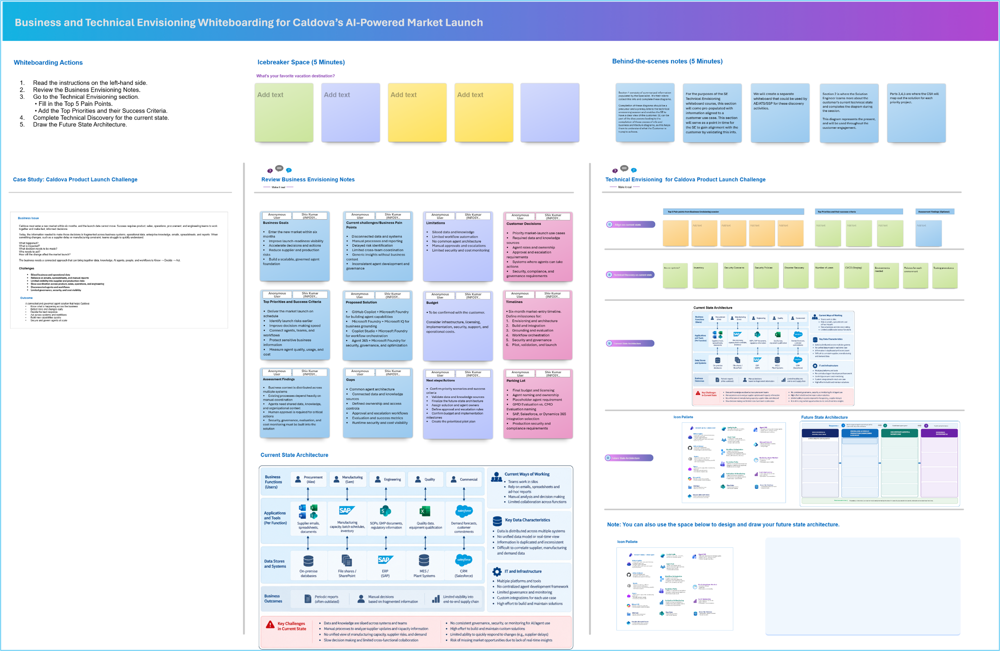

## 1. Envisioning Session Using Whiteboarding

### Whiteboarding

Whiteboarding helps technical and business teams align on **business goals, current challenges, future-state architecture, and solution priorities**. It turns ideas into a shared visual plan and establishes the foundation for the agentic solution participants will build throughout the workshop.

## Caldova Market Launch Scenario

Caldova has **six months to enter a new market**, and the launch date will not move. Today, critical data, knowledge, and decisions are spread across product, sales, operations, engineering, and enterprise systems. This makes it difficult to identify changes, understand their impact, coordinate decisions, and act quickly.

You will start with whiteboarding to envision a future-state intelligent solution that can:

- **Know** what is happening across Caldova using business data, enterprise knowledge, and organizational context.
- **Detect** supplier, manufacturing, and launch-readiness changes early.
- **Assess** the impact on the market launch plan.
- **Decide** the appropriate response and recommend corrective actions.
- **Coordinate** agents, teams, and workflows across the business.
- **Act** through governed business processes with human approval where required.
- **Build** new agent capabilities quickly when gaps are identified.
- **Secure, govern, and optimize** agents from development through runtime.

### Outcome
By the end of the envisioning session, participants have a shared view of **Caldova's business challenge, future-state agent architecture, key agent interactions, and solution priorities** that guides the rest of the hands-on workshop.

> **Know. Decide. Act. Build. Govern. Get Caldova into the new market before the competition.**

### What Changed
Whiteboarding is connected directly to Caldova's six-month market-launch story and serves as the entry point to the four workshop topics. This makes the whiteboard the beginning of one continuous journey rather than a separate activity.

## How to copy the Whiteboard using an existing template URL

1. Open a new browser tab in the Edge browser.

1. Right-click on the following Whiteboard template link -  ["Whiteboard Template"](https://sandboxailabs1002-my.sharepoint.com/:wb:/g/personal/amplify_user_sandboxailabs1002_onmicrosoft_com/IQDTzUYleJUrSam4WftDPpZ2AX33HhN8Z7CFeGr_t79F1p0?e=PeZ7Jf), then select **Copy link** and then paste it on the browser tab.

1. If prompted, sign in with your ODL user credentials.

1. Once you log in, you will get a pop-up message to create the new Whiteboard. Read the message and click **Got it**.

   

1. Use the **Zoom out** option to view the Whiteboard template clearly.

   

1. Please follow along as the **Facilitator** guides you through the **Business** and **Technical** Envisioning Session. During the session, you will identify key business challenges, define priorities, assess the current environment, and design a future-state solution architecture.

### Activities

1. Review the **Business Envisioning Notes** to understand the organization's goals, challenges, and desired outcomes.

1. Go to the **Technical Envisioning** section and:
   - Capture the **Top 5 Pain Points**.
   - Define the **Top Priorities** and corresponding **Success Criteria**.

1. Complete the **Technical Discovery** by documenting:
   - Current-state architecture
   - Systems

1. Design the **Future-State Architecture** to illustrate how the proposed solution addresses business needs and technical requirements.

1. Review the completed envisioning outputs and validate their alignment with the desired business outcomes.

## Next plan for Future State Architecture

Once the **Future State Architecture** has been defined during the Envisioning session, the next step is to bring the proposed solution to life as a working prototype.

**Traditional Approach:**

1. Traditionally, after completing the architecture and identifying the required solution components, the next step would be to manually translate the design into Azure resources and configurations. This typically involves:

   - Identifying all the resources required for the solution.
   - Determining the Resource Groups and services where they should be created.
   - Creating and configuring the resources individually.
   - Setting up the required data sources, connections, and dependencies.
   - Validating that the components work together as intended.

1. The traditional approach can be time-consuming and heavily dependent on specialized experience, particularly when developing and implementing agent-driven capabilities. 

1. In the next exercise, we will introduce a prototype-based approach that demonstrates how GitHub Copilot can accelerate the same activities with minimal manual effort, helping teams improve productivity, reduce errors, and focus more on expressing the desired solution, validating the outcome, and refining the prototype rather than manually building each individual component

### Now, click **`Next >>`** in the lower-right corner to move on to **`Rapid Prototyping`**.
