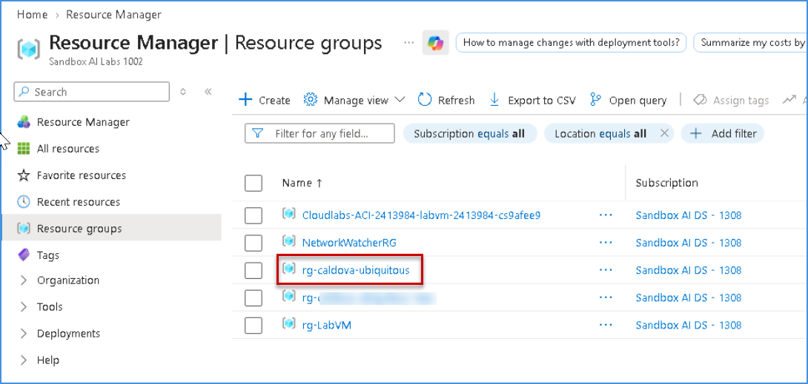
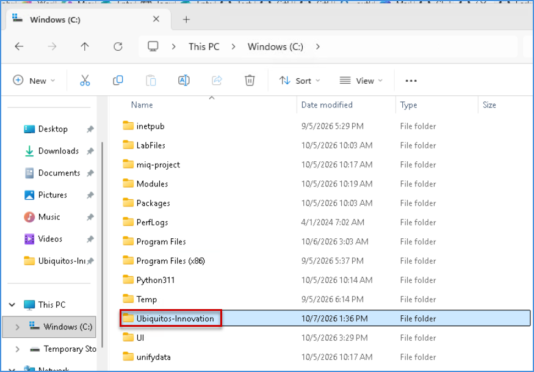
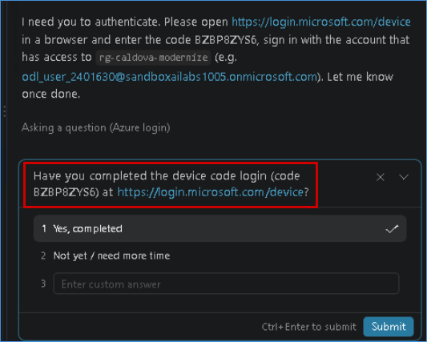
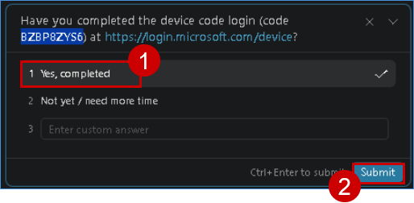
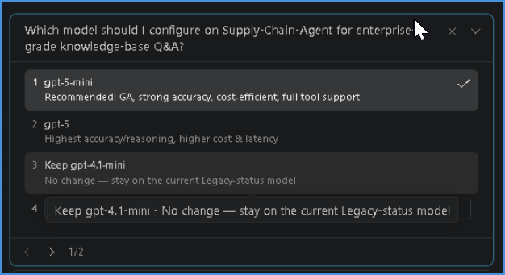
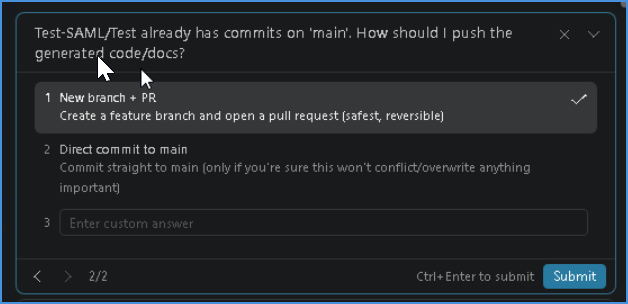

# 2. Rapid Prototyping


Now that you have completed the envisioning **Whiteboard session** and identified key business opportunities, it is time to move from ideas to a working prototype. Explore how a intelligent solution can bring the envisioned scenario to life, validate its potential, and demonstrate how it could work in practice.

## Rapid Prototyping using GitHub Copilot

You will use GitHub Copilot to generate ARM or Bicep templates using the Future State Architecture arrived at from the previous Whiteboarding exercise.

- **ARM templates:** JSON-based Infrastructure-as-Code files used to define and deploy Azure resources.
- **Bicep templates:** Simplified, declarative Infrastructure-as-Code files used to define and deploy Azure resources with cleaner syntax.

### Verify Resources in the Azure Resource Group

1. Navigate to the [Azure portal](https://portal.azure.com/). Search for **Resource groups**. and Click on **rg-unified** Resource Group.

   

1.  Confirm that the resource group contains the following resources:
      - **Fabric Capacity**
      - **Storage Account**

1. Verify that the resources are available in their respective Azure regions and that the migration environment has been provisioned successfully.

## Sign in to GitHub Copilot Chat

1. Click on the **Visual Studio Code** from the VM desktop.

   

1. Click on **Continue with GitHub** to sign in to GitHub Copilot.

   

1. On the **Sign in to GitHub** tab, enter the provided **GitHub username** **(1)** in the input field, and click on **Sign in with your identity provider** to continue **(2)**.

    - **Username:** <inject key="GitHub User Name" enableCopy="true"/>

     

1. Click on **Continue** on the **Single sign-on to CloudLabs Organizations** page to proceed.

   

1. Click on **Accept**.

   

1. Select **Continue** to **Authorize Visual Studio Code**.

   

1. Select **Authorize Visual Studio Code**.

   

1. Select **Open**.

   

1. Once the Visual Studio code opens, choose any desired theme **(1)** and then click **Get Started (2)**.

   

   

   >**Note:** If you get any error pop up, please **Close.**

      

    - **Close** the pop up.  

     >**Note**: Please follow the steps sequentially as indicated by the numbered brackets (e.g., (1), (2), …) and execute them in the specified order.

1. Select **File (1)** and then **Open Folder (2)**.

   

1. Navigate to **`C:\`** path **(1)**, then select the **Unifydata** folder **(2)** and then **Select folder (3)**.

   

1. From the **GitHub Copilot Chat**, select **Models (1)** and then select **Trust Workspace to enable models (2)**.

   

1. Select **Trust Folder and Continue**.

   

1. Click **Auto (1)** and then set the model to **Claude Sonnet 5 (2)**.

   

    >**Note:** If you're unable to select the **Models**, please wait for `2-3 minutes` then check and make sure you're signed in properly.

1. Click on **Default permission (1)** and then set it to **Allow all (2)**.

   

1. Select **Enable**.

   

## Topic 1 - Build agents and software at the speed of AI
Transform an existing agent design into a **production-ready, secure capability** using GitHub Copilot—from whiteboard and business decisions to implementation, testing, security remediation, review, and merge. Demonstrate how **AI-assisted planning, model choice, delegated coding, governance, and security** accelerate agent development while keeping humans in control.

### Creating Supply Chain Agent in Foundry

1. Please copy the below prompt and paste it in the copilot chat win

   ```
   For the first activity, create a Supply Chain Agent in Azure AI Foundry and configure it with a SharePoint Knowledge Base. Please follow the steps below and complete the task:
   
   Attached to future state architecture: Future-State-Architecture.png
   
   Instructions:
     1. Use existing resource group   (rg-caldova-ubiquitous-new)
     2. Create a new Foundry Project   (Supply-Chain-Mgmt)
     3. Create a new Foundry AI Agent   (Supply-Chain-Agent)
     4. Create a new Knowledge source under this   above created Foundry AI Agent and point to   Work IQ SharePoint (Path: https://sandboxailabs1002.sharepoint.com/sites/EnterpriseAIKnowledgeBase/)
         a. Use folder: AI Knowledge Base (All enterprise level documents available here)
     5. Add agent instruction based on   knowledgebase included in agent
     6. Validate the question and answer will be performed with this agent regarding this knowledgebase.
     7. Generate code for all the above steps and push to the GIT Repo: Test-SAML/Test

   Note: After completing all above steps successfully, create README.md file with deployment instructions and post deployment configurations steps. Also generate bicep/ARM template based on the identified resources
   ```

   - Then click **Send** button.
  
1. Once Copilot starts generating the response, monitor the process closely. 

1. If Copilot Asks to aunthenticate like below, please click on provided link and provide the code which was given by copilot 

   

1. Click on Yes, completed and then click on **Submit** button
    
    

1. After some time, Copilot may ask you a few questions. Review each question carefully and select the appropriate response. 

1. Monitor the process to understand how it generates the response and handles or resolves errors.  

   >**Note:** In between, if it asks you to **Continue to iterate**, please click **Continue**.
   
   >Wait for the deployment to complete.

### Model Addition in Foundry Agent

1. Please copy the below prompt and paste it in the copilot chat win

   ```
   Great. You have created the Azure AI Foundry Agent for me. Now, identify the most suitable model for the Knowledge Base attached to the agent to provide accurate, enterprise-level responses, and configure the selected model with the agent.

   Instructions:
      1. Use existing Foundry AI Agent    (Supply-Chain-Agent) and validate below   commands to check if any model is added in our agent or not.
         a.	/model
         b.	/model auto
         c.	/usage
         d.	/context
         Note: Run these commands one by one and   show    the result and take human  confirmation.
      2. Choose suitable model for our Agent which can help to search for text from the agent Knowledgebase.
      3. Save the Agent changes and publish.
      4. Prepare some questions based on the Agent Knowledgebase and document it and store it.
      5. Also validating the question and answer will be performed with this agent regarding this knowledgebase.
      6. Generate code for all the above steps and push to the GIT Repo: Test-SAML/Test

   Note: After completing all above steps successfully, create README.md file with deployment instructions and post deployment configurations steps. Also generate bicep/ARM template based on the identified resources
   ```

   - Then click **Send** button.
  
1. Once Copilot starts generating the response, monitor the process closely. 

1. Click on appropriate model and PR option to update proceed further
    
    

    

1. After some time, Copilot may ask you a few questions. Review each question carefully and select the appropriate response. 

1. Monitor the process to understand how it generates the response and handles or resolves errors.  

   >**Note:** In between, if it asks you to **Continue to iterate**, please click **Continue**.
   
   >Wait for the deployment to complete.

#### Congratulations! You have successfully completed the `Rapid Prototyping using GitHub Copilot` session.
