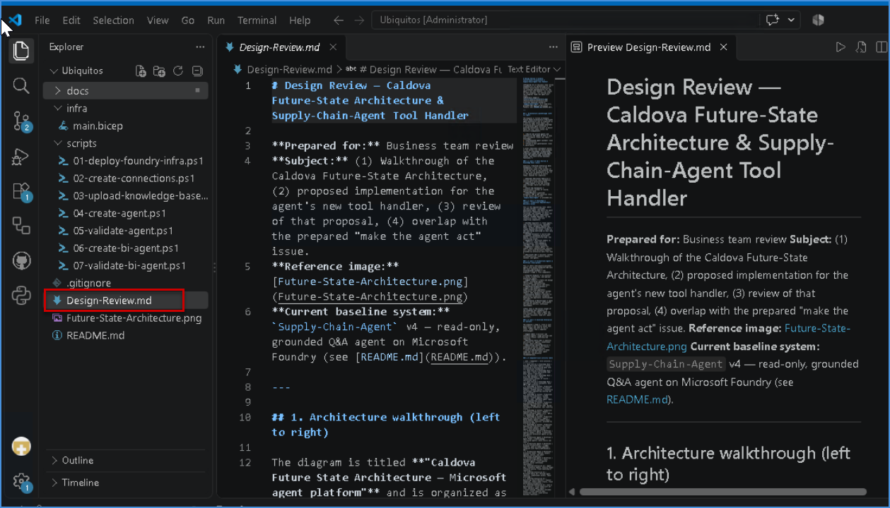
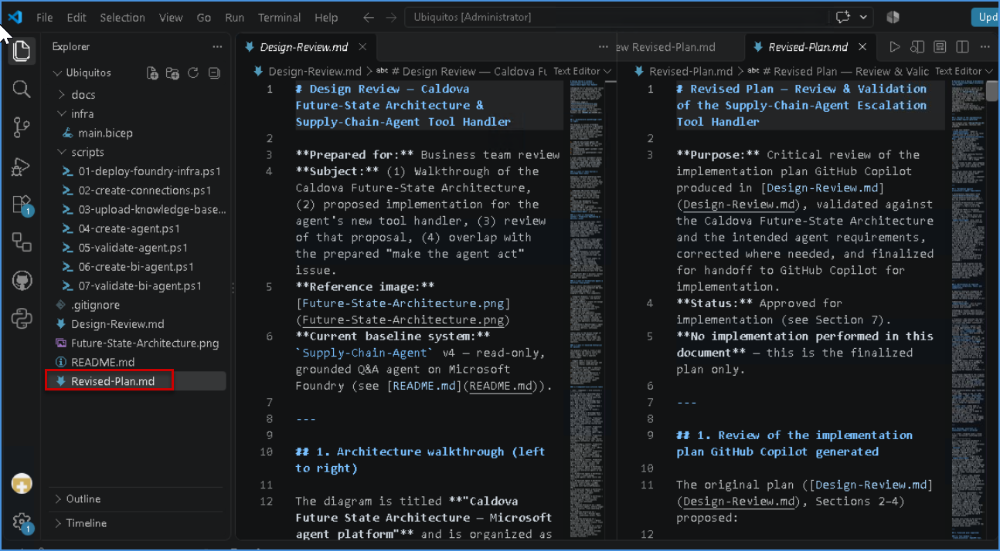
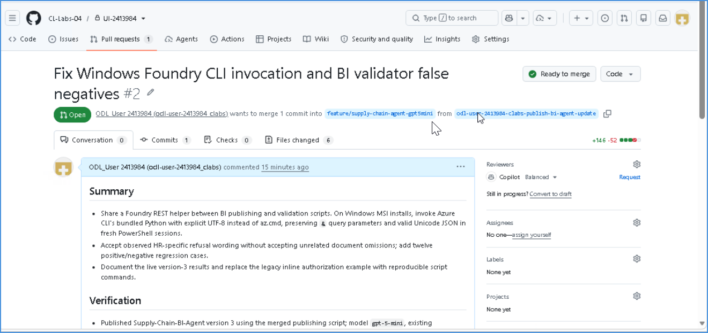
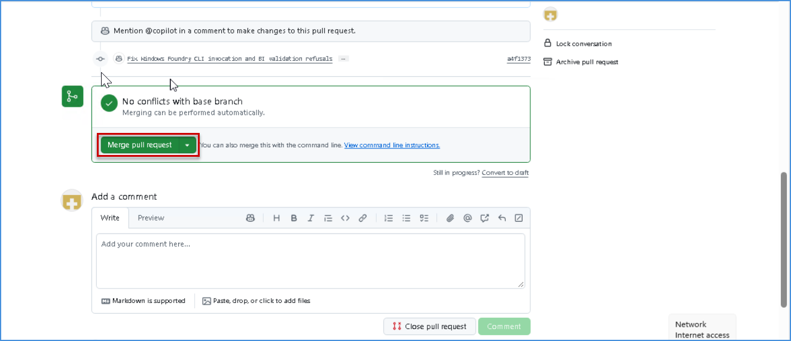

# 2. Rapid Prototyping


Now that you have completed the envisioning **Whiteboard session** and identified key business opportunities, it is time to move from ideas to a working prototype. Explore how a intelligent solution can bring the envisioned scenario to life, validate its potential, and demonstrate how it could work in practice.

## Rapid Prototyping using GitHub Copilot

You will use GitHub Copilot to generate ARM or Bicep templates using the Future State Architecture arrived at from the previous Whiteboarding exercise.

- **ARM templates:** JSON-based Infrastructure-as-Code files used to define and deploy Azure resources.
- **Bicep templates:** Simplified, declarative Infrastructure-as-Code files used to define and deploy Azure resources with cleaner syntax.

### Verify Resources in the Azure Resource Group

1. Navigate to the [Azure portal](https://portal.azure.com/). Search for **Resource groups**. and Click on **rg-unified** Resource Group.

   

1.  Confirm that the resource group contains the following resources:
      - **Fabric Capacity**
      - **Storage Account**

1. Verify that the resources are available in their respective Azure regions and that the migration environment has been provisioned successfully.

## Sign in to GitHub Copilot Chat

1. Click on the **Visual Studio Code** from the VM desktop.

   

1. Click on **Continue with GitHub** to sign in to GitHub Copilot.

   

1. On the **Sign in to GitHub** tab, enter the provided **GitHub username** **(1)** in the input field, and click on **Sign in with your identity provider** to continue **(2)**.

    - **Username:** <inject key="GitHub User Name" enableCopy="true"/>

     

1. Click on **Continue** on the **Single sign-on to CloudLabs Organizations** page to proceed.

   

1. Click on **Accept**.

   

1. Select **Continue** to **Authorize Visual Studio Code**.

   

1. Select **Authorize Visual Studio Code**.

   

1. Select **Open**.

   

1. Once the Visual Studio code opens, choose any desired theme **(1)** and then click **Get Started (2)**.

   

   

   >**Note:** If you get any error pop up, please **Close.**

      

    - **Close** the pop up.  

     >**Note**: Please follow the steps sequentially as indicated by the numbered brackets (e.g., (1), (2), …) and execute them in the specified order.

1. Select **File (1)** and then **Open Folder (2)**.

   

1. Navigate to **`C:\`** path **(1)**, then select the **Unifydata** folder **(2)** and then **Select folder (3)**.

   

1. From the **GitHub Copilot Chat**, select **Models (1)** and then select **Trust Workspace to enable models (2)**.

   

1. Select **Trust Folder and Continue**.

   

1. Click **Auto (1)** and then set the model to **Claude Sonnet 5 (2)**.

   

    >**Note:** If you're unable to select the **Models**, please wait for `2-3 minutes` then check and make sure you're signed in properly.

1. Click on **Default permission (1)** and then set it to **Allow all (2)**.

   

1. Select **Enable**.

   

## Topic 1 - Build agents and software at the speed of AI
Transform an existing agent design into a **production-ready, secure capability** using GitHub Copilot—from whiteboard and business decisions to implementation, testing, security remediation, review, and merge. Demonstrate how **AI-assisted planning, model choice, delegated coding, governance, and security** accelerate agent development while keeping humans in control.

### Activity 1.1: Start Whiteboarding
Review the prepared **Future-State-Architecture** design and walk through the four key areas: what the agent needs to know, the tools it can call and the production systems behind those tools, what actions it can perform autonomously versus where human approval is required, and where the agent will run once built. The starting point is that the agent already answers questions, but no code for the new action capability exists yet; the whiteboard represents the design for this new capability and serves as the foundation for the implementation activities that follow.

Whiteboard [Link](https://sandboxailabs1002-my.sharepoint.com/:wb:/g/personal/amplify_user_sandboxailabs1002_onmicrosoft_com/IQDTzUYleJUrSam4WftDPpZ2AX33HhN8Z7CFeGr_t79F1p0?e=PeZ7Jf)

Whiteboard Image
 

### Activity 1.2: Turn the Whiteboard into a Reviewed Plan
Turn the whiteboard into a reviewed implementation plan and issue set for extending the existing agent, without manually transcribing it.

1. Please copy the below prompt and paste it in the copilot chat win

   >- This activity is required to validate the future-state architecture before development begins and ensure the proposed solution aligns with the business requirement.
   >- Review the architecture to understand each component and determine how the new tool-handler capability should be implemented, documented, and reviewed by the business team.

   
   **Prompt**
   ```
   For my first activity, I have attached a whiteboard-generated future-state architecture design. Please review the architecture thoroughly and create a document based on your analysis. Follow the instructions below for this activity:
   
   Attached to future state architecture: Future-State-Architecture.png

   Instructions:
   1.	Read the attached design and list down all the sections starting form left to right and explain in detail.  Also generate one tabular format to understand each section and component wise activity.
   2.	Propose implementation of the new tool handler. 
   3.	Review what comes back: the proposed tool handler, the changes to the agent instructions, the test approach, and the issues it would open. 
   4.	Compare its proposed issues against the prepared “make the agent act” issue and point out the overlap. 
   5.	Once all the above steps are completed, generate one Design-Review.md file with proper design for business team to review
   Note: Please don’t create any other document or code at this moment apart from Design-Review.md. 
   ```

   - Then click **Send** button.

1. Once Copilot starts generating the response, monitor the process closely. 

#### Validation
Once GitHub Copilot completes the execution, validate the Project Explorer to confirm whether the review document has been successfully created and is available in the expected project location.

1. Navigate to the project explorer in VS code to validate review docuemnt.

   

### Activity 1.3: Turn the Whiteboard into a Reviewed Plan
Turn the whiteboard into a reviewed implementation plan and issue set for extending the existing agent, without manually transcribing it.

1. Please copy the below prompt and paste it in the copilot chat window.


   ```
   Great. You have created above design review guide. Now review the same with below points and provide me with instructions and after confirmation include them in the same document.

   Instructions:
   1.	Review the implementation plan generated by GitHub Copilot.
   2.	Validate the plan against the intended agent requirements and architecture.
   3.	Verify that all required components, primitives, tools, and agent capabilities are correctly captured.
   4.	Identify and correct any missing, incorrect, or unnecessary items in the plan.
   5.	Finalize and approve the plan before handing it off to GitHub Copilot for implementation.
   ```

   - Then click **Send** button.

1. Once Copilot starts generating the response, monitor the process closely. 

#### Validation

   


### Activity 1.4: Choose the Model for the Job
Select the most appropriate model for the task while staying within the models and policies enabled by the organization. Review the available models using /model, switch between models to understand that model selection is task-specific, and use /model auto to allow GitHub Copilot to select an appropriate model based on the task, effort, and optimization settings such as Balanced versus Intelligence. Use /usage to review session usage and /context to understand the available context and session information. Finally, repeat the same task using a Frontier model and Auto mode to compare their output, performance, value, and cost, and understand when each approach is most appropriate.

Based on the context, the user can switch between the available models and validate their suitability for the task. Finally, select the **Auto** option to allow GitHub Copilot to automatically choose the most appropriate model based on the requirements and complexity of the work.

   

### Activity 1.5: Hand the Build to the Coding Agent
Validate the local changes from Activities 1.2 and 1.3, then use /delegate from the same GitHub Copilot session to hand off the implementation to the coding agent, accepting the checkpoint so the agent branch includes the existing scaffold and updated instructions. While the agent works, review the session log and reasoning, and demonstrate concurrent work by showing another active session before returning to the current task. 

Once complete, open the draft pull request in GitHub and verify that the diff includes the tool handler, updated agent instructions, and tests. Before human review, request a Copilot code review, evaluate its findings, and then add a follow-up comment beginning with @copilot requesting any necessary revisions so Copilot updates and commits the changes to the same branch.

1. Please copy the below prompt and paste it in the copilot chat win

   ```
   1. Run /delegate and accept the checkpoint to delegate the implementation.
   2. Update Review-Plan.md with the final agent instructions, tool-handler requirements, constraints, and test approach.
   Monitor the coding-agent execution and 
   3. Create a Draft Pull Request when complete.
   ```

   - Then click **Send** button.

1. After completing above step, validate the Pull Request with passing below prompt:

   ```
   1. @copilot Please address the valid review findings, update the implementation, Review-Plan.md, agent instructions, and tests as needed, and commit the revisions to the same PR branch. Do not merge.
   2. Confirm the revised changes are committed to the same PR branch and report any remaining issues requiring human review.
   ```

   - Then click **Send** button.
  
### Activity 1.6: Fix Security in the Same Pull Request
Review the capability to ensure it aligns with the agreed business requirements, governance standards, approval boundaries, and risk controls. Confirm that all identified business risks are addressed, required stakeholder approvals are obtained, and the capability is ready for release. 

**Objective:** Demonstrate a complete business journey from design and review through risk validation, approval, and final release, ensuring the capability is governed and business-ready before user adoption.

1. Navigate to Github.com and open the pull request

1. Select Approve and run workflows to allow the required checks to begin.

1. Review the code scanning results and identify the flagged vulnerability in the tool handler.

1. Review the Autofix recommendation and commit the fix directly to the same Pull Request branch.

1. Wait for all required checks and validations to complete successfully.

1. Obtain the required human or CODEOWNER approval.

1. Review the final changes and merge the Pull Request.

#### Validation
Pull request created for review and commit. 

1. Open the Pull request and validate the summary
   

1. After validation, merge pull request and commit.
   


## Topic 2: Agents That Know Your Business 

### Activity 2.1: Validate the Deployed Business Intelligence Agent

### Activity 2.2: Connect Live Manufacturing Context

### Activity 2.3: Ground the Agent with Enterprise Knowledge

### Activity 2.4: Add Organizational Context

### Activity 2.5: Enable the Agent to Act

### Activity 2.6: Evaluate the Agent 

## Topic 3: From One Agent to a Coordinated System 

## Continue...

#### Congratulations! You have successfully completed the `Rapid Prototyping using GitHub Copilot` session.
