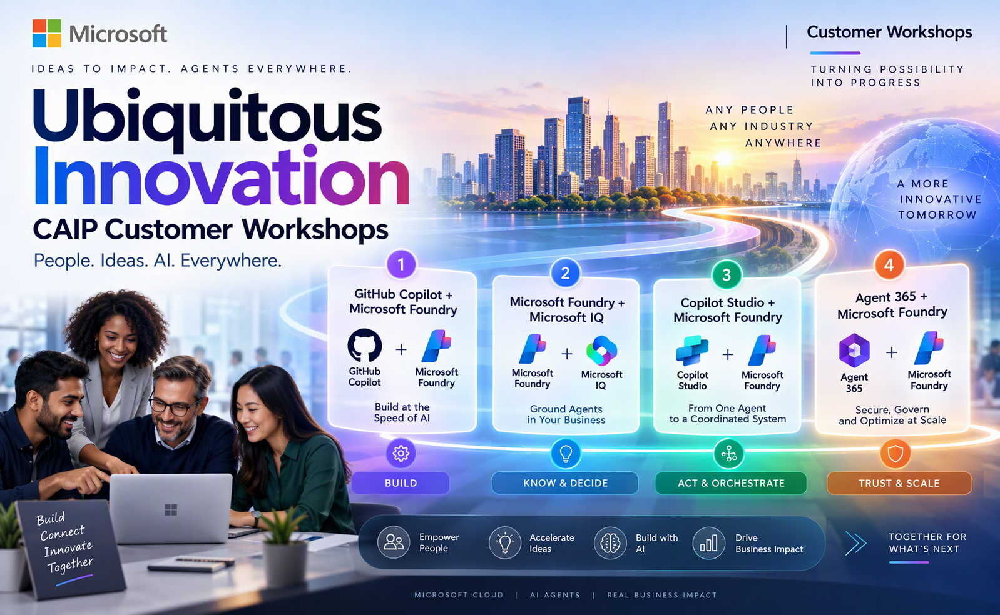

# Ubiquitous Innovation CAIP Customer Workshops
*Build, Connect, Govern. Innovate Everywhere*
 
 
## In This Workshop, you will

Caldova has **six months to enter a new market**. Participants will experience how AI agents can help turn this business challenge into action through one connected journey:

**Know the business → Decide what to do → Act across workflows → Build what’s missing → Secure & Govern at scale**

### Topic 1: Build Agents and Software at the Speed of AI

**GitHub Copilot + Microsoft Foundry**

Participants will see how a business requirement moves from whiteboarding to implementation. They will use Copilot to ground requirements, select the right model, extend an existing agent, review code, address security findings, and deploy the agent to Microsoft Foundry.

### Topic 2: Agents That Know Your Business

**Microsoft Foundry + Microsoft IQ**

Participants will enhance the same agent with:

- Live manufacturing data through **Fabric IQ**
- Enterprise knowledge through **Foundry IQ**
- Organizational context through **Work IQ**
- Tools that enable controlled business actions
- Evaluations to measure and improve agent quality

### Topic 3: From One Agent to a Coordinated System

**Copilot Studio + Microsoft Foundry**

Participants will create a **Market Launch Coordinator** and connect the existing specialist agent into an end-to-end workflow.

The experience will:

**Detect change → Gather context → Assess launch impact → Recommend action → Request approval → Take action**

This demonstrates how multiple agents and workflows can work together while keeping people involved for approvals and exceptions.

### Topic 4: Secure, Govern, and Optimize Agents

**Agent 365**

Participants will explore how to manage agents at scale by reviewing:

- Agent identity and ownership
- Security and governance controls
- Prompt-injection protection
- Sensitive-data protection
- Security events
- Model and token usage
- Cost visibility and optimization

## Caldova Scenario

**Challenge:** Enter a new market within six months while competitors are moving quickly.

**Problem:** Critical data, knowledge, decisions, and workflows are distributed across teams and systems.

**Approach:** Create a common agent foundation that enables AI agents to understand business context, coordinate decisions, take actions, and operate securely.

**Goal:** **Know. Decide. Act. Get Caldova into the new market before the competition.**

## Workshop Outcomes

By the end of the workshop, participants will understand how to:

1. **Build** agent capabilities using pro-code and low-code experiences.
2. **Ground** agents in operational data, enterprise knowledge, and organizational context.
3. **Evaluate** agent quality and improve responses.
4. **Connect** agents and workflows to turn insights into actions.
5. **Secure and govern** agents from development through runtime.
6. **Monitor and optimize** agent usage, models, and cost.

## Accessing your Sandbox Environment

1. Once you're ready to dive in, your Virtual machine and Guide will be right at your fingertips within your web browser.

    >**Note**: If prompted, click on **Accept** to Proceed.

     

1. On your Virtual machine, click on the **Azure Portal** icon.

   

1. You'll see the **Sign into Microsoft Azure** tab. Here, enter your credentials:

   - **Email/Username:** <inject key="AzureAdUserEmail"></inject>

     

1. Next, provide your password:
 
   - **Password:** <inject key="AzureAdUserPassword"></inject>

     

1. If a pop-up appears **Stay signed in**, then select **Yes**.

   

1. You will return to this portal in the upcoming steps. Keep the portal open and proceed with the next steps.

### Now, click on **`Next >>`** to continue with **`Envisioning Session Using Whiteboarding`**.
